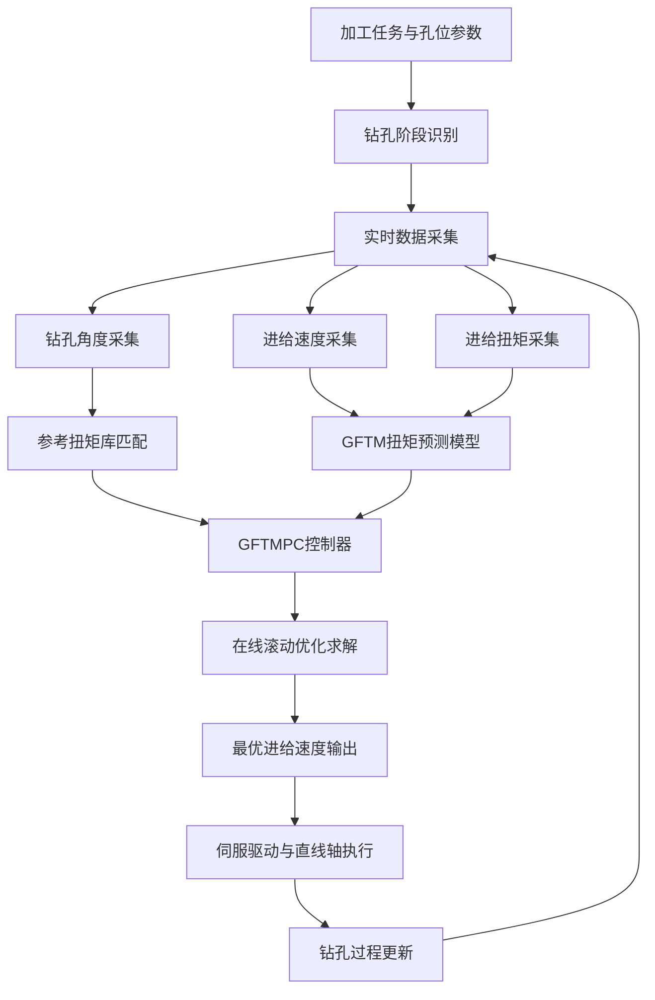
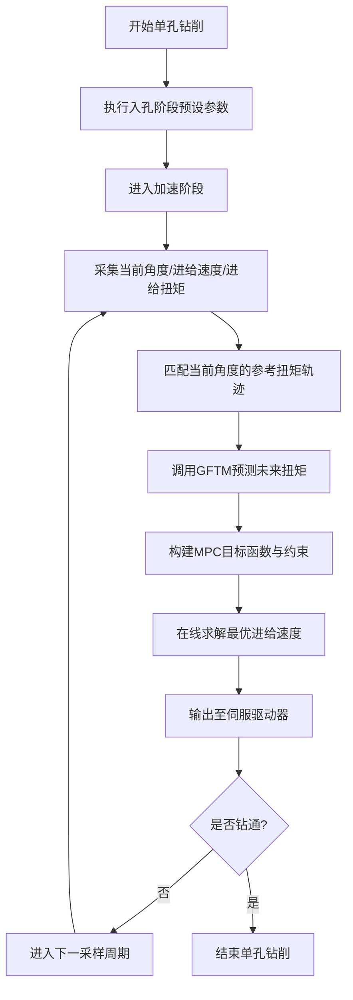

# 技术交底书

**案件名称**：一种基于GFTMPC的柔性钻孔控制方法  
**技术联系人**：  
- 姓名：待填写  
- 电话：待填写  
- 邮箱：待填写  

**专利类型**：发明

---

## 注意事项

（1）本交底书依据《硕士学位论文V7.0.pdf》与《硕士学位论文V7.0.docx》第四章“基于GFTMPC的柔性钻孔控制方法”整理形成，并结合公开现有技术进行了差异化归纳。  
（2）本交底书聚焦“方法发明”，保护重点放在分段式钻孔工艺基础上的扭矩预测、参考扭矩生成、在线优化控制与抗干扰调速闭环，而非单纯机械结构本体。  
（3）文中个别参数范围可在后续与发明人核对后进一步收紧，不影响当前技术方案的完整性。

## 一、介绍相关技术背景，描述与本发明最接近的现有技术，并说明现有技术存在的缺点

### 1.1 现有技术

围绕本发明最接近的现有技术，可归纳为以下三类。

#### 1.1.1 轮胎模具自动钻孔设备类

1. **CN105397148A，轮胎模具专用数控自动钻孔机**  
该专利公开了一种面向轮胎模具的专用数控自动钻孔机，通过底座、工装夹具、立柱、悬臂、旋转臂和电主轴等机构实现轮胎模具的多角度钻孔，重点解决人工钻孔效率低、位置一致性差的问题。其核心改进在于通过机械结构实现模具翻转、主轴进给及角度调整，从而提升自动化程度、定位精度与钻孔一致性。  
局限性在于：该方案的关注重点是机床结构与夹持/姿态调整机构，并未围绕深孔加工过程中“切屑堵塞导致扭矩升高、断刀风险增加”的动态问题建立在线控制机制，也未给出基于实时扭矩反馈的进给速度柔性调节方法。  
来源链接：https://patents.google.com/patent/CN105397148A/zh

2. **CN118492458A，一种用于轮胎模具自动钻孔的机器人系统及其控制方法**  
该专利公开了轮胎模具自动钻孔机器人系统及其控制方法，重点在于机械臂、直线驱动单元、可换刀主轴、钻套、刀架、接触式测头等部件协同，以及基于上位机提取孔位坐标并驱动机器人完成取刀、探测、定位和钻孔的自动化流程。  
其技术重点仍然偏向系统构型、定位流程与自动化执行链路，能够提高轮胎模具钻孔的自动化和柔性程度。  
局限性在于：虽然具备自动钻孔控制流程，但未进一步针对钻削过程中的扭矩时序特征、不同钻孔角度造成的载荷变化、以及干扰工况下的进给调节问题提出数据驱动预测加MPC滚动优化的柔性控制方法。  
来源链接：https://patents.google.com/patent/CN118492458A/en

#### 1.1.2 柔性自适应钻孔装置类

3. **CN115106566B，一种柔性自适应钻孔装置**  
该专利名称表明其面向柔性自适应钻孔装置，主要关注钻孔执行机构、导向和装置层面的柔性适应能力。  
此类方案通常通过结构适应、导向补偿、机械随动等方式改善加工稳定性，能够在一定程度上缓解钻孔姿态变化与加工干扰问题。  
局限性在于：其技术路线主要是装置层面柔性，而非在控制算法层面对钻孔负载进行预测、构造参考扭矩轨迹并在线求解最优进给速度，因此对复杂深孔工况下的动态抗扰与闭环优化支持有限。  
来源链接：https://patents.google.com/patent/CN115106566B/zh

#### 1.1.3 机器人钻孔测量与神经网络预测控制类

4. **Frommknecht 等：Multi-sensor measurement system for robotic drilling**  
该文献提出了一种机器人钻孔多传感器测量系统，用于建立机器人与工件之间的六维位姿关系，并在钻孔点执行正交对齐，以提升机器人钻孔定位精度。  
该类技术能够提高机器人钻孔的参考坐标精度和垂直度控制，但主要解决的是定位与测量问题，而非钻削过程的负载预测与进给闭环调节问题。  
来源链接：https://www.sciencedirect.com/science/article/abs/pii/S0736584515301472

5. **Zarzycki 等：Advanced predictive control for GRU and LSTM networks**  
该文献公开了GRU/LSTM网络与模型预测控制结合的先进预测控制方法，说明以循环神经网络作为预测模型、以MPC为在线优化控制框架在复杂动态系统中具有可行性。  
该文献属于通用预测控制方法研究，并非针对轮胎模具小直径深孔钻削场景设计，未涉及钻孔角度变化、参考扭矩库构建、切屑堵塞诱发的断刀判据及钻孔进给柔性控制。  
来源链接：https://www.sciencedirect.com/science/article/pii/S0020025522011987

#### 1.1.4 检索总结

现有技术已经分别在以下方面有所公开：

1. 轮胎模具自动钻孔设备结构与动作执行。
2. 机器人自动钻孔系统的定位、换刀与流程控制。
3. 某些柔性钻孔装置的机械适应结构。
4. 通用神经网络预测控制方法。

但是，现有技术尚未形成以下一体化技术链路：  
“以轮胎模具排气孔小直径深孔多角度钻削为对象，基于分段式钻孔工艺，实时采集钻孔角度、进给速度和进给扭矩，构建不同钻孔角度下的参考扭矩库，采用GRU建立进给扭矩预测模型，并将该预测模型嵌入模型预测控制器中进行在线滚动优化，以在切屑堵塞或外部扰动出现时主动降低进给速度、在负载恢复后再平滑提速，实现抗断刀的柔性钻孔控制闭环。”

### 1.2 现有技术存在的缺点

结合上述现有技术，主要存在以下不足：

1. 现有设备类方案主要解决“能否自动钻”，但对“如何在深孔复杂负载下稳定钻”关注不足。
2. 现有自动钻孔控制流程多为固定工艺参数或预设动作逻辑，难以应对切屑堵塞、材料不均匀、刀具磨损等引起的实时扭矩波动。
3. 钻孔角度变化会改变重力分量、摩擦状态和切削负载，现有方案通常缺乏针对不同角度工况的参考轨迹与控制基准。
4. 传统PID、固定参数控制或纯经验调节方式在非线性、多约束、强扰动的深孔钻削场景下难以兼顾稳定性、实时性和断刀风险控制。
5. 通用GRU/LSTM-MPC研究虽提供方法启发，但没有落地到轮胎模具深孔钻削场景，也没有构造与钻孔工况强绑定的参考扭矩库和三阶段工艺控制逻辑。

## 二、针对上述缺点，说明本发明所要解决的技术问题

本发明所要解决的技术问题是：

在轮胎模具排气孔的小直径深孔、多角度钻削过程中，针对切屑堵塞、负载波动和钻孔角度变化引起的进给扭矩非线性变化，提供一种能够实时预测负载趋势、在线优化进给速度、在扰动条件下抑制扭矩异常升高并降低断刀风险的柔性钻孔控制方法。

进一步地，本发明具体解决以下子问题：

1. 如何在不同钻孔角度条件下建立可用于控制的参考扭矩基准。
2. 如何用数据驱动方式预测下一时刻或未来短时域的进给扭矩变化。
3. 如何将扭矩预测结果与MPC结合，对进给速度进行在线滚动优化。
4. 如何使控制器在加速阶段和稳定钻孔阶段兼顾加工效率与刀具安全。
5. 如何在轻微或明显干扰下使进给扭矩在短时间内回归参考轨迹附近，避免持续超载导致断刀。

## 三、本发明技术方案的详细阐述

### 3.1 背景

轮胎模具排气孔加工具有规格多、数量多、小直径深孔、钻孔角度随曲面法向变化的特点。第四章研究结果表明，固定参数钻孔虽然加工时间较短，但在深孔加工后期容易因切屑排出不畅导致进给扭矩持续升高，最终引发断刀。  

论文第四章对固定参数钻孔与分段式钻孔进行了对比测试，在同样的机器人自动钻孔系统上各进行了100次水平钻孔测试。结果表明，分段式钻孔方案的成功率由81%提升至92%，说明将钻孔过程分阶段处理能够有效降低入孔和加速阶段的断刀风险。  

但进一步分析发现，即使采用分段式钻孔，在加速阶段和进入稳定钻孔阶段后仍可能因切屑堵塞导致扭矩升高和断刀。正常钻孔与断刀时的切屑形态和进给扭矩对比说明：断刀前往往伴随切屑紊乱、团聚、排屑通道受阻以及进给扭矩持续上升。由此可知，进给扭矩能够有效反映刀具载荷和排屑状态，适合作为柔性控制反馈量。

因此，本发明在分段式钻孔基础上，针对加速阶段和稳定钻孔阶段引入基于GFTMPC的柔性控制，实现进给速度的实时优化调节。

### 3.2 系统框图

### 3.3 模块功能说明

1. **钻孔阶段识别模块**  
将单孔钻削过程划分为入孔阶段、加速阶段和稳定钻孔阶段。其中，入孔阶段采用预设安全参数；加速阶段和稳定钻孔阶段启用本发明柔性控制算法。

2. **实时数据采集模块**  
实时采集当前钻孔角度、进给速度和进给扭矩。根据论文第四章的数据采集架构，上位机采集钻孔角度信息，PLC作为数据中转节点采集伺服驱动器反馈的进给速度与进给扭矩，并转发给上位机。

3. **参考扭矩库匹配模块**  
针对不同钻孔角度建立参考扭矩库。钻孔开始后，根据当前孔位对应的钻孔角度，从参考扭矩库中调取或插值得到该角度工况下的目标参考扭矩轨迹。

4. **GFTM扭矩预测模块**  
基于GRU神经网络建立进给扭矩预测模型GFTM。输入历史进给速度序列、历史进给扭矩序列以及当前钻孔角度序列，输出未来时刻的进给扭矩预测值。

5. **GFTMPC控制模块**  
将GFTM作为预测模型嵌入模型预测控制器中，通过目标函数最小化“预测扭矩与参考扭矩偏差”和“进给速度变化量”两部分代价，在速度上限、下限及速度增量约束下在线求得最优进给速度。

6. **执行与反馈模块**  
将当前采样周期求得的最优进给速度发送至伺服驱动器和直线轴执行机构，实现进给运动调节；执行结果再反馈进入下一控制周期，形成闭环。

### 3.4 系统流程说明

#### 3.4.1 关键创新流程

本发明的关键创新不在于简单地“检测扭矩过大则减速”，而在于如下闭环流程：

1. 先利用不同角度工况下的历史正常钻孔数据建立参考扭矩库，使控制目标不再是统一常数，而是与角度相关的动态目标轨迹。
2. 再利用GRU模型对未来扭矩进行短时预测，使控制器不只对“当前误差”响应，还能对“未来趋势”提前动作。
3. 再通过MPC在时域内滚动优化进给速度，使控制器能同时满足参考跟踪和平滑调速的双目标，并处理速度边界与速度变化率约束。
4. 当切屑堵塞、刀具磨损或扰动引起扭矩偏离参考轨迹时，控制器主动降低进给速度减载；当扭矩恢复正常后，控制器再平滑提速，避免二次冲击。

### 3.5 关键技术参数

根据第四章内容，本发明可采用如下参数体系实施：

1. **钻孔阶段划分**：至少包括入孔阶段、加速阶段和稳定钻孔阶段。
2. **反馈量**：进给扭矩。
3. **控制量**：进给速度。
4. **采样周期**：可取0.3 s。
5. **数据采集变量**：至少包括钻孔角度、进给速度、进给扭矩。
6. **参考扭矩库来源**：基于正常钻孔数据，对不同角度下的加速阶段和稳定阶段扭矩曲线进行最小二乘拟合。
7. **GFTM模型输入**：历史进给速度序列、历史进给扭矩序列、当前钻孔角度序列。
8. **GFTM模型输出**：未来时刻的进给扭矩预测值。
9. **模型结构示例**：输入维度为3，输入序列长度为2，输出序列长度为1，隐藏层节点数为128。
10. **训练参数示例**：采用Adam优化算法，批量大小为128，最大训练轮次为100。
11. **模型性能示例**：R²=0.9682，MAE=0.0016，RMSE=0.0022，MAPE=1.9914%。
12. **扰动程度分类示例**：相对参考扭矩偏差小于10%定义为无干扰，10%至20%定义为轻微干扰，大于20%定义为明显干扰。
13. **MPC约束**：包括进给速度上限、进给速度下限和进给速度增量约束；在论文仿真中，最大进给速度可设置为400 mm/min。

### 3.6 可选实施方式

为扩展保护范围，本发明不限于论文中给出的唯一实现方式，还可包括以下变形：

1. GFTM中的神经网络可替换为GRU变体、LSTM或其他适于时序预测的循环神经网络。
2. 参考扭矩库可采用分段线性拟合、样条拟合、查表插值或聚类建模方式构建。
3. 控制器可部署于上位机、边缘控制器或运动控制器中。
4. 采样周期可根据通信能力与系统实时性要求缩短或延长。
5. 钻孔对象不限于轮胎模具排气孔，也可推广到其他小直径深孔、多角度孔或复杂曲面法向钻孔场景。

## 四、与现有技术相比，本发明具有哪些优点？

1. **针对性更强**  
直接面向轮胎模具排气孔小直径深孔多角度加工场景，针对切屑堵塞诱发的断刀风险设计控制方法，而非停留在通用设备结构或通用控制理论层面。

2. **由被动响应升级为预测控制**  
不仅检测当前扭矩异常，而且通过GFTM对未来扭矩进行预测，使调速动作具备前瞻性。

3. **适应不同钻孔角度工况**  
通过参考扭矩库将钻孔角度纳入控制目标生成过程，解决了不同角度下扭矩水平显著不同的问题。

4. **兼顾稳定性与效率**  
通过MPC同时约束扭矩跟踪误差和进给速度增量，避免控制动作过猛，在抑制断刀的同时尽量维持加工效率。

5. **抗干扰能力强**  
论文第四章仿真与实验结果表明，在不同干扰程度、不同干扰引入时刻及不同钻孔角度条件下，控制器均可维持闭环稳定，并使进给扭矩在约3 s内回归参考轨迹附近。

6. **工程应用效果明确**  
在三个轮胎模具花纹块上的1038孔实际加工中，平均孔深73.6 mm、平均单孔时间17.8 s，全程未出现断刀，说明本发明具备良好的工程实用性。

## 五、本发明的技术关键点和欲保护点是什么？

建议重点保护以下技术要点：

1. 一种柔性钻孔控制方法，其特征在于：在分段式钻孔工艺基础上，针对加速阶段和稳定钻孔阶段，实时采集钻孔角度、进给速度和进给扭矩，并根据钻孔角度调用对应参考扭矩轨迹，对进给速度进行闭环柔性调节。

2. 一种参考扭矩生成方法，其特征在于：基于不同钻孔角度下的正常钻孔数据，构建角度关联的参考扭矩库，用于为后续控制提供目标扭矩轨迹。

3. 一种扭矩预测方法，其特征在于：采用GRU神经网络，以历史进给速度、历史进给扭矩和当前钻孔角度为输入，输出未来时刻进给扭矩预测值。

4. 一种基于预测模型的模型预测控制方法，其特征在于：将扭矩预测模型嵌入MPC，在预测时域和控制时域内联合优化扭矩跟踪误差与速度变化量，求取当前时刻最优进给速度。

5. 一种抗干扰调速机制，其特征在于：当预测或检测到进给扭矩高于参考扭矩时，主动降低进给速度以减轻刀具负载；当扭矩恢复至参考轨迹附近时，再逐步提高进给速度。

6. 一种适用于多角度深孔钻削的柔性控制方法，其特征在于：控制目标与控制策略均根据钻孔角度变化动态切换或匹配。

7. 上述方法在轮胎模具排气孔钻削中的应用。

## 六、其它

### 6.1 实施例

实施例一：  
在机器人自动钻孔系统中，先对单孔钻削过程划分为入孔、加速和稳定钻孔三个阶段；入孔阶段采用预设安全参数执行，避免刚接触工件时发生冲击。  

当系统进入加速阶段后，上位机以0.3 s为周期采集当前钻孔角度、进给速度和进给扭矩；根据当前钻孔角度从参考扭矩库中匹配目标扭矩轨迹；再调用GFTM预测未来时刻的进给扭矩；控制器以“预测扭矩与参考扭矩的偏差最小、速度变化量最小”为目标，在速度上下限和速度增量约束下求解最优进给速度，并将当前控制周期的第一步最优速度发送给伺服驱动器。  

在稳定钻孔阶段，若切屑排出顺畅，则扭矩沿参考轨迹平稳变化，控制器维持较高进给速度；若切屑堵塞或外部扰动使扭矩快速升高，则控制器主动减速，使刀具载荷下降；当扭矩恢复至参考轨迹附近后，再平滑提升进给速度。  

采用该方法对三个轮胎模具花纹块进行钻孔实验，共加工1038个排气孔，在平均孔深73.6 mm、平均单孔时间17.8 s条件下未出现断刀，验证了该方法的有效性。

### 6.2 可补强的数据与材料

后续可继续补充以下材料，以便撰写权利要求书时进一步增强稳定性：

1. 入孔阶段、加速阶段和稳定钻孔阶段的具体阈值条件。
2. 参考扭矩库的完整拟合公式及全部角度参数表。
3. MPC目标函数中的权重系数、预测时域和控制时域具体数值。
4. 速度上下限、速度增量上限在不同钻头直径和材料条件下的推荐范围。
5. 不同孔径、不同材料和不同润滑条件下的扩展实验数据。

