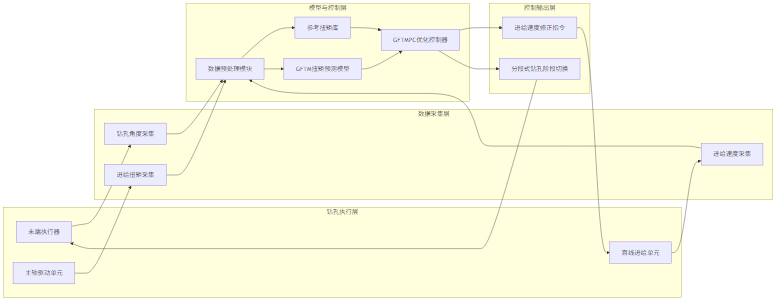
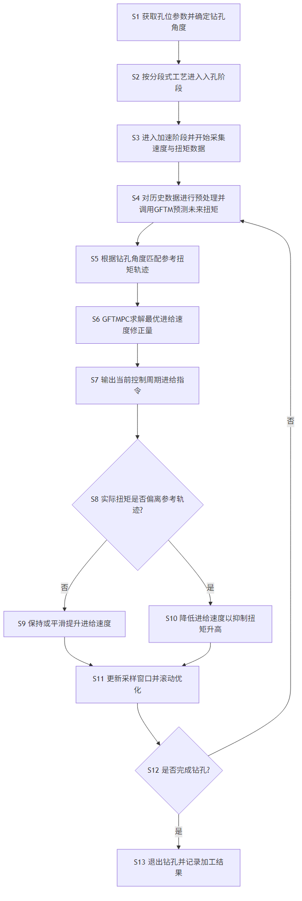

# 技术交底书

**案件名称**：一种基于GFTMPC的柔性钻孔控制方法
**技术联系人**：
- 姓名：待填写
- 电话：待填写
- 邮箱：待填写

**专利类型**：发明

---

## 注意事项

（1）本交底书依据《硕士学位论文V7.0.pdf》及《硕士学位论文V7.0.docx》第四章内容整理，用于支撑代理人形成专利申请文件。  
（2）文中对企业专有信息进行了适度脱敏，但保留了技术方案的关键逻辑、控制闭环和可实施细节。  
（3）本文中的参数范围、工艺阶段、控制流程和技术效果用于说明发明构思，不应理解为对保护范围的唯一限定。

## 一、介绍相关技术背景，描述与本发明技术最相近的现有技术，并说明该现有技术存在的缺点

### 1.1 现有技术

围绕小直径深孔钻削中的稳定控制问题，现有技术大致可归纳为以下三类。

1. 钻孔机器人作业参数自适应调控类技术。  
代表方案如 CN121630354A《一种防突钻孔机器人作业参数自适应调控方法》，通过多源传感监测钻具动态响应和环境参数，并据此联动调控钻压、转速和进给速度，形成闭环调节。该类方案强调钻进安全和参数联动调节，能够应对工况突变。  
来源链接：http://epub.cnipa.gov.cn/patent/CN121630354A

2. 基于进给-扭矩闭环的加工控制类技术。  
代表方案如 CN116984665A《基于鼠笼式异步电机的铣削加工系统及模糊逻辑控制方法》，通过建立进给速度、负载和主轴电流/扭矩之间的闭环关系，对加工状态进行预测与控制。该类方案说明了“加工负载反馈驱动进给调节”的总体思路，对复杂加工过程中的负载调节具有借鉴意义。  
来源链接：http://epub.cnipa.gov.cn/patent/CN116984665A

3. 面向加工负载变化的进给速度动态调节类技术。  
代表方案如 CN121879273A《一种木材切削负载自适应的CNC进给速度动态调节方法》，通过前瞻负载估计和实时功率反馈形成目标进给速度指令，实现加工过程中的动态调节。该类方案体现了“预测负载+在线修正进给”的控制思路，但主要针对木材加工场景。  
来源链接：http://epub.cnipa.gov.cn/patent/CN121879273A

综合来看，现有技术已经能够实现一定程度的参数自适应调节、负载反馈控制和预测式进给调节，但针对轮胎模具排气孔这一类“小直径、深孔、多角度、排屑敏感”的钻孔场景，仍缺乏一种将钻孔角度、历史进给速度、历史进给扭矩以及未来扭矩预测统一纳入闭环优化的柔性控制方法。

### 1.2 现有技术存在的缺点

1. 现有自适应钻孔控制方案大多面向煤层钻进、掘进或一般机器人作业场景，对轮胎模具排气孔加工中“多角度深孔+切屑堵塞致断刀”的问题针对性不足。

2. 现有基于扭矩或电流反馈的闭环加工控制多应用于铣削或一般切削过程，难以刻画深孔钻削中扭矩随钻孔深度、钻孔角度及排屑状态变化而呈现出的强非线性时序特征。

3. 现有基于模型预测控制的加工调节方案往往依赖较强的机理模型，而小直径深孔钻削中，轴向负载、孔壁摩擦、切屑阻塞和重力分量共同作用，导致系统难以建立精确显式模型。

4. 现有方案普遍缺少面向不同钻孔角度工况的参考轨迹库，导致控制器难以对角度变化引起的扭矩基线变化进行柔性适配。

5. 现有方案较少将“分段式钻孔工艺”与“数据驱动预测模型”以及“滚动优化控制”协同设计，难以同时兼顾断刀抑制、加工效率、实时性和鲁棒性。

## 二、针对上述缺点，说明本发明所要解决的技术问题

本发明要解决的技术问题是：针对轮胎模具排气孔加工过程中，由于钻孔角度变化、深孔排屑不畅、进给扭矩非线性波动而引起的断刀风险高、加工稳定性差以及难以建立精确模型的问题，提供一种基于 GFTMPC 的柔性钻孔控制方法，使控制系统能够在不同钻孔角度和不同干扰程度下，对进给速度进行实时柔性调节，从而抑制进给扭矩异常升高，降低切屑堵塞导致的断刀风险，并兼顾钻孔效率与控制稳定性。

## 三、本发明技术方案的详细阐述

### 3.1 背景

本发明适用于具有多品种、小批量、小直径深孔和多角度分布特征的模具排气孔自动钻削场景。钻孔过程中，进给速度直接影响切屑形成速度与排屑压力；进给扭矩则能够反映刀具负载和排屑状态。当切屑堵塞、摩擦增大或钻孔姿态发生变化时，进给扭矩会持续升高，并诱发刀具失稳乃至断刀。

针对上述问题，本发明以分段式钻孔工艺为基础，在加速钻孔阶段和稳定钻孔阶段引入柔性控制。通过采集钻孔角度、进给速度和进给扭矩数据，建立基于 GRU 的进给扭矩预测模型 GFTM；再结合不同钻孔角度下构建的参考扭矩库，利用模型预测控制构建 GFTMPC 控制器，对进给速度进行滚动优化调节，形成“工况识别-扭矩预测-约束优化-执行修正”的闭环控制。

### 3.2 系统框图

### 3.3 模块功能说明

1. 末端执行器与主轴/直线进给单元。  
负责完成排气孔钻削动作，其中主轴提供稳定转速，直线进给单元按照控制指令输出进给运动。

2. 钻孔角度采集模块。  
用于获取当前孔位对应的钻孔姿态角，以表征不同角度下重力分量、摩擦负载和排屑条件的变化。

3. 进给速度采集模块。  
用于实时记录执行器的实际进给速度，作为构建时序状态和滚动优化反馈的重要输入。

4. 进给扭矩采集模块。  
用于实时监测进给驱动负载，进给扭矩既用于建立历史时序样本，也作为反馈量表征排屑状态和刀具负载。

5. 数据预处理模块。  
对采集到的角度、进给速度和进给扭矩数据进行平滑、分段、对齐和窗口化处理。例如，对时序数据进行滑动平均降噪，以减少随机噪声对预测模型的影响。

6. 参考扭矩库。  
基于不同钻孔角度下的正常钻孔样本建立参考扭矩轨迹集合，并在控制时根据当前钻孔角度匹配对应的参考扭矩轨迹，为控制器提供目标跟踪基线。

7. GFTM 扭矩预测模型。  
采用 GRU 神经网络建立钻孔过程时序预测模型，输入历史进给速度序列、历史进给扭矩序列以及当前钻孔角度信息，输出未来时刻的进给扭矩预测值。

8. GFTMPC 优化控制器。  
将参考扭矩、扭矩预测结果、速度约束和速度变化率约束纳入统一目标函数，通过滚动优化求得最优进给速度修正量，并在每个控制周期仅施加当前步控制量。

9. 分段式钻孔阶段切换模块。  
用于对入孔阶段、加速阶段和稳定钻孔阶段进行阶段划分，其中柔性控制主要作用于加速阶段和稳定阶段。

### 3.4 系统流程说明

### 3.4.1 具体步骤

S1. 读取待加工孔位的空间位姿信息，确定当前孔位对应的钻孔角度，并根据工艺参数设置主轴转速和初始进给速度。

S2. 按分段式钻孔工艺执行入孔阶段，以较低进给速度接触工件并钻入预设深度；入孔结束后切换至加速阶段。

S3. 在加速阶段及其后的稳定钻孔阶段，以固定采样周期采集钻孔角度、进给速度和进给扭矩数据，并构建当前控制窗口的历史序列。

S4. 对采集数据进行预处理，至少包括平滑降噪、时间对齐和窗口切分；将所述历史进给速度序列、历史进给扭矩序列及当前钻孔角度信息输入 GFTM，获得未来一个或多个控制步的进给扭矩预测值。

S5. 按当前钻孔角度从参考扭矩库中匹配对应的参考扭矩轨迹，作为当前控制周期的目标跟踪轨迹。

S6. 构建 GFTMPC 目标函数，目标函数至少同时约束以下两项：
- 预测扭矩与参考扭矩之间的跟踪误差；
- 连续控制周期之间进给速度变化量的平滑性。

S7. 在目标函数求解过程中叠加进给速度上下限约束和进给速度增量约束，得到未来控制序列中的最优进给速度修正序列。

S8. 采用滚动优化策略，仅将最优控制序列中的当前步进给速度修正量输出至直线进给单元，驱动执行器完成本控制周期的进给调整。

S9. 当实际进给扭矩高于参考扭矩且偏差持续增大时，控制器主动降低进给速度，以降低切屑生成速率和刀具负载，减轻切屑堵塞。

S10. 当实际进给扭矩回落至参考轨迹附近时，控制器按约束条件逐步提高或恢复进给速度，以兼顾加工效率和过程稳定性。

S11. 在下一采样周期，更新历史序列、重新预测未来扭矩并重新求解优化问题，直至当前孔位钻削完成。

S12. 钻孔完成后记录当前孔位的钻孔时长、扭矩波动和是否出现异常等结果，用于后续工艺优化和样本扩充。

### 3.5 关键技术参数

1. 钻孔工艺阶段。  
钻孔过程至少划分为入孔阶段、加速阶段和稳定钻孔阶段；柔性控制优选作用于加速阶段和稳定钻孔阶段。

2. 反馈变量。  
优选以进给扭矩作为主反馈量，因为该量能够表征刀具负载、孔壁摩擦和排屑状态变化。

3. 预测模型输入。  
GFTM 的输入至少包括历史进给速度序列、历史进给扭矩序列和当前钻孔角度。

4. 预测模型结构。  
优选采用 GRU 神经网络，隐藏层节点数可设置为 128；模型训练时可采用 Adam 优化算法。

5. 数据处理参数。  
可采用窗口大小为 10 的滑动平均方式进行降噪处理；训练集、验证集和测试集可按照 7:2:1 的比例划分。

6. 控制周期。  
优选控制周期为 0.3 s，以兼顾现场通讯能力与滚动优化实时性。

7. 约束条件。  
至少包括进给速度上限、进给速度下限以及相邻控制周期之间的速度增量约束，以避免速度剧烈波动导致冲击。

8. 干扰等级判别。  
可按实际扭矩相对于参考扭矩的超出比例对干扰程度进行分类，例如小于 10% 为无明显干扰，10% 至 20% 为轻微干扰，大于 20% 为明显干扰。

9. 性能指标。  
GFTM 预测模型的决定系数 R² 优选达到 0.9682；实际控制中进给扭矩优选可在约 3 s 内回归至参考轨迹附近。

## 四、与现有技术相比，本发明具有哪些优点？

1. 本发明将分段式钻孔工艺、参考扭矩库、GRU 扭矩预测模型和模型预测控制有机融合，形成适用于轮胎模具排气孔场景的专用柔性控制闭环，针对性强。

2. 相较于仅依赖规则或固定参数的控制方案，本发明能够根据钻孔角度变化和实时扭矩变化在线调整进给速度，更适合多角度深孔工况。

3. 相较于依赖精确机理模型的传统 MPC，本发明使用 GFTM 对未来扭矩进行数据驱动预测，降低了对复杂钻削机理显式建模的依赖。

4. 相较于单纯反馈式调速，本发明利用未来扭矩预测结果进行滚动优化，既能提前响应异常趋势，又能限制控制量突变，提高控制平滑性。

5. 本发明能够在扭矩异常升高时主动抑制进给速度，减小切屑堵塞和刀具过载风险，从而有效降低断刀概率。

6. 在实际工程验证中，本发明在平均钻孔深度 73.6 mm、共 1038 个孔的加工任务中未出现断刀，表明其具有较好的稳定性和工程可实施性。

## 五、本发明的技术关键点和欲保护点是什么？

1. 一种以钻孔角度、历史进给速度和历史进给扭矩作为状态输入，并由 GRU 神经网络输出未来进给扭矩预测值的钻孔扭矩预测建模方法。

2. 一种针对不同钻孔角度建立参考扭矩轨迹库，并在控制过程中按当前钻孔角度进行匹配调用的方法。

3. 一种将预测扭矩与参考扭矩之间的误差以及进给速度变化量共同纳入目标函数的钻孔模型预测控制方法。

4. 一种在分段式钻孔的加速阶段和稳定阶段实施滚动优化控制，而在入孔阶段采用低速稳健接触策略的分阶段控制方法。

5. 一种在每个采样周期仅执行最优控制序列当前步控制量、并在下一采样周期重新预测和重优化的闭环柔性钻孔控制方法。

6. 一种通过扭矩偏差大小触发进给速度降低、并在扭矩恢复后平滑回升进给速度的断刀抑制控制机制。

7. 上述方法在自动钻孔机器人系统中的应用，包括数据采集单元、参考扭矩库、GFTM 模块、GFTMPC 控制模块和进给执行模块之间的协同关系。

## 六、其他

### 6.1 实施例

实施例 1：分段式钻孔工艺验证。  
在水平钻孔条件下，分别对固定参数钻孔方案和分段式钻孔方案进行 100 次测试。结果表明，分段式钻孔方案将钻孔成功率由 81% 提升至 92%，说明分段工艺是实施柔性控制的有效基础。

实施例 2：GFTM 预测模型训练。  
采集 459 组钻孔过程数据，按 7:2:1 划分训练集、验证集和测试集，并采用窗口法构造时序样本。训练完成后，模型预测精度 R² 达到 0.9682，MAE 为 0.0016，RMSE 为 0.0022，MAPE 为 1.9914%，表明该模型可用于钻孔扭矩预测。

实施例 3：不同干扰工况下的控制仿真。  
在控制周期 0.3 s 条件下，将所述 GFTM 嵌入 GFTMPC 控制器，对不同钻孔角度、不同干扰程度以及不同干扰引入时刻进行仿真。结果表明，控制器能够根据偏差程度主动降低进给速度，并使进给扭矩在约 3 s 内恢复至参考轨迹附近。

实施例 4：实际钻孔实验。  
在自动钻孔机器人系统上对三个轮胎模具花纹块进行钻孔实验，共完成 1038 个排气孔加工，平均钻孔深度为 73.6 mm，平均单孔钻削时间为 17.8 s，实验过程中未出现断刀，表明本发明具有良好的实时性、鲁棒性和工程应用价值。

### 6.2 可进一步补强的材料

1. GFTM 的网络层数、输入窗口长度和训练参数的替代实施方式。

2. 参考扭矩库按角度区间、材料种类或孔深区间分层构建的实施方式。

3. 进给速度约束、速度增量约束和目标函数权重的范围化参数说明。

4. 进给扭矩异常识别阈值与断刀预警阈值的联动机制。

5. 面向不同孔径、不同材质和不同刀具规格的迁移实施方案。
