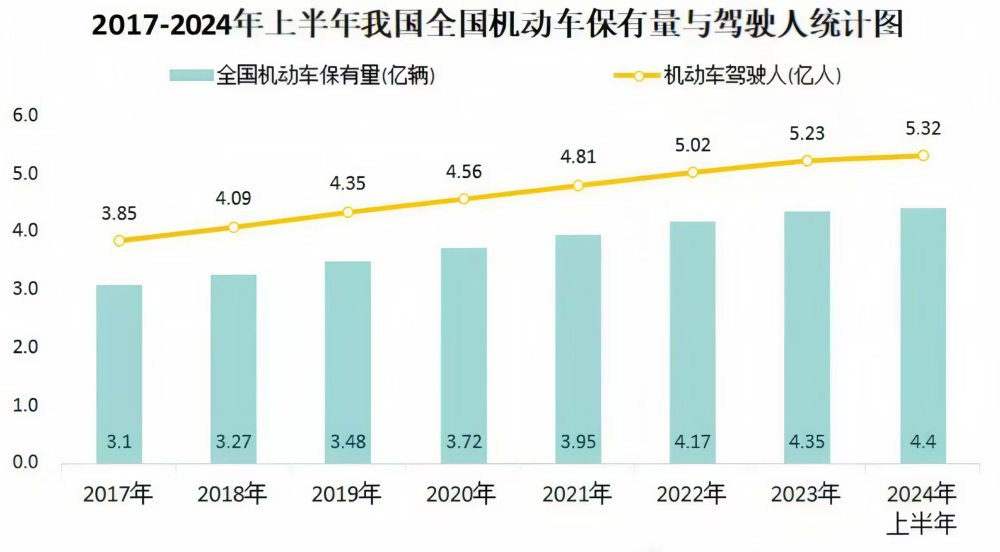
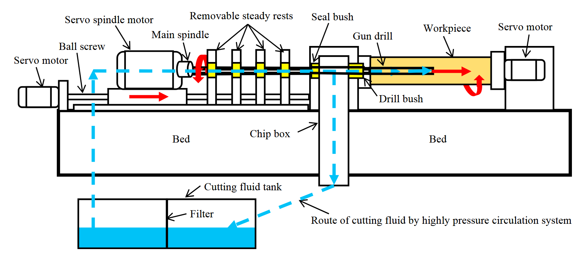
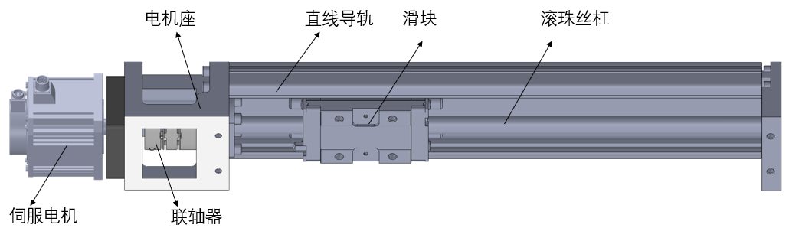
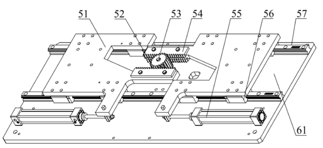
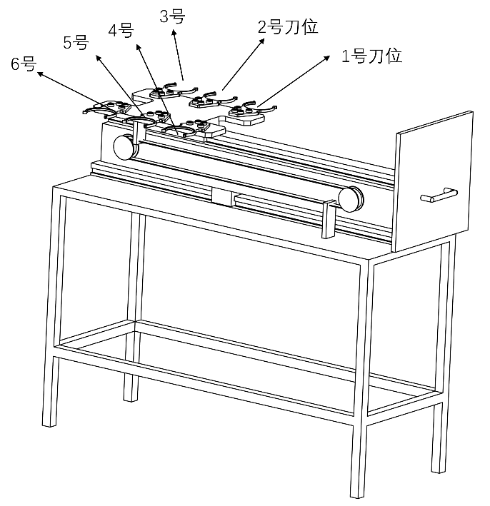
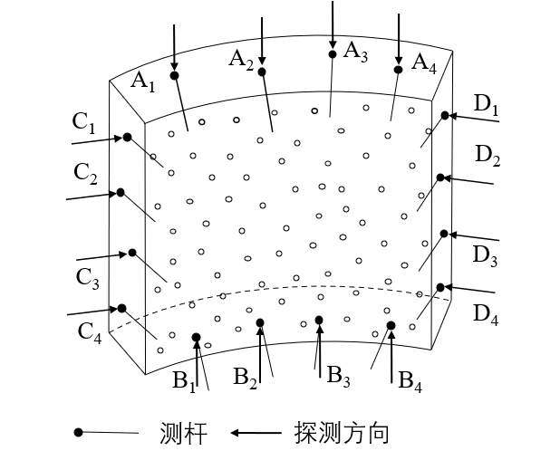
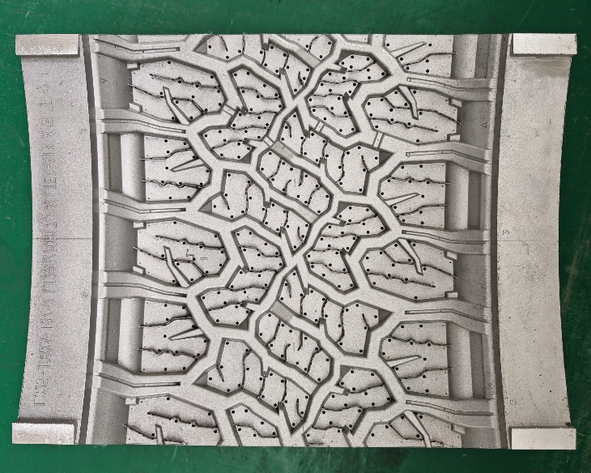
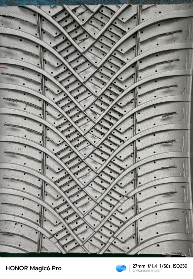

<!-- 由 docx_to_md.py 自 硕士学位论文V7.0.docx 转换，勿手改本行元信息 -->

分类号：TP242

学  号：202321100340

__硕 士 学 位 论 文__

__（学 术 学 位）__

轮胎模具自动钻孔机器人系统开发

及柔性控制方法研究

作者姓名

赵云浩

指导教师

崔焕勇

合作导师

刘海宁

专业名称

机械工程

学位类别

工学硕士

答辩时间

2026年5月 日

__Research on the Development of an Automated Drilling Robot System for Tire Molds and Flexible Control Methods__

By

Zhao Yunhao

Under the Supervision of

Cui Huanyong

A Thesis Submitted to the University of Jinan

In Partial Fulfillment of the Requirements

For the Degree of Master of Engineering

__University of Jinan__

__Jinan, Shandong, P\. R\. China__

May, 2026

此列汉字小三号楷体，英文或数字等用小三号Times New Roman，居中

原创性声明

本人郑重声明：所呈交的学位论文，是本人在导师的指导下，独立进行研究所取得的成果。除文中已经注明引用的内容外，本论文不包含任何其他个人或集体已经发表或撰写过的科研成果。对本文的研究作出重要贡献的个人和集体，均已在文中以明确方式标明。本人完全意识到本声明的法律责任由本人承担。

论文作者签名：                日  期：               

关于学位论文使用授权的声明

本人完全了解济南大学有关保留、使用学位论文的规定，同意学校保留或向国家有关部门或机构送交论文的复印件和电子版，允许论文被查阅和借鉴；本人授权济南大学可以将学位论文的全部或部分内容编入有关数据库进行检索，可以采用影印、缩印或其他复制手段保存论文和汇编本学位论文。

（保密论文在解密后应遵守此规定）

论文作者签名：             导师签名：             日期：           

目  录

[摘  要	V](#_Toc226888605)

[__Abstract__	VII](#_Toc226888606)

[1 绪论	1](#_Toc226888607)

[1\.1 研究背景及意义	1](#_Toc226888608)

[1\.2 国内外研究现状	2](#_Toc226888609)

[1\.2\.1 自动钻孔机器人技术研究现状	2](#_Toc226888610)

[1\.2\.2 机器人系统工件定位方法研究现状	5](#_Toc226888611)

[1\.2\.3 小直径深孔钻削研究现状	6](#_Toc226888612)

[1\.3 当前存在的主要问题	8](#_Toc226888613)

[1\.4 本文主要研究内容	9](#_Toc226888614)

[2 轮胎模具自动钻孔机器人系统设计	11](#_Toc226888615)

[2\.1 系统总体设计方案	11](#_Toc226888616)

[2\.2 机械系统设计	12](#_Toc226888617)

[2\.2\.1 末端执行器	13](#_Toc226888618)

[2\.2\.2 工件夹持装置	16](#_Toc226888619)

[2\.2\.3 刀架	17](#_Toc226888620)

[2\.3 控制系统设计	17](#_Toc226888621)

[2\.3\.1 PLC控制系统	17](#_Toc226888622)

[2\.3\.2 机器人控制程序	20](#_Toc226888623)

[2\.3\.3 上位机控制软件	21](#_Toc226888624)

[2\.4 软硬件系统集成	25](#_Toc226888625)

[2\.5 本章小结	26](#_Toc226888626)

[3 基于接触式测头的排气孔定位方法	27](#_Toc226888627)

[3\.1 接触式测头及机器人系统集成	27](#_Toc226888628)

[3\.2 基于接触式测头的排气孔定位方法	28](#_Toc226888629)

[3\.3 定位精度影响因素分析	30](#_Toc226888630)

[3\.4 探测逻辑与探测方式优化	32](#_Toc226888631)

[3\.5 实机验证	33](#_Toc226888632)

[3\.6 本章小结	35](#_Toc226888633)

[4 基于GFTMPC的柔性钻孔控制方法	37](#_Toc226888634)

[4\.1 钻孔分析	37](#_Toc226888635)

[4\.1\.1 钻孔方案与断刀原因分析	37](#_Toc226888636)

[4\.1\.2 钻孔过程分析	39](#_Toc226888637)

[4\.2 相关原理介绍	40](#_Toc226888638)

[4\.2\.1 模型预测控制原理	40](#_Toc226888639)

[4\.2\.2 GRU神经网络原理	43](#_Toc226888640)

[4\.3 基于GFTMPC的柔性钻孔控制器	44](#_Toc226888641)

[4\.3\.1 GFTM预测模型构建	44](#_Toc226888642)

[4\.3\.2 GFTMPC柔性钻孔控制器构建	45](#_Toc226888643)

[4\.4 数据采集与分析	48](#_Toc226888644)

[4\.4\.1 数据采集	48](#_Toc226888645)

[4\.4\.2 数据分析	49](#_Toc226888646)

[4\.5 方法验证	51](#_Toc226888647)

[4\.5\.1 参考扭矩库的构建	51](#_Toc226888648)

[4\.5\.2 模型训练与性能验证	51](#_Toc226888649)

[4\.5\.3 钻孔仿真验证	53](#_Toc226888650)

[4\.5\.4 钻孔实验验证	59](#_Toc226888651)

[4\.6 本章小结	63](#_Toc226888652)

[5 系统应用与产线集成	65](#_Toc226888653)

[5\.1 轮胎模具多工序柔性自动生产线	65](#_Toc226888654)

[5\.2 MES系统集成	66](#_Toc226888655)

[5\.3 系统应用	68](#_Toc226888656)

[5\.3 本章小结	71](#_Toc226888657)

[6 总结与展望	73](#_Toc226888658)

[6\.1 总结	73](#_Toc226888659)

[6\.2 展望	73](#_Toc226888660)

[参考文献	75](#_Toc226888661)

[致  谢	81](#_Toc226888662)

[附  录	83](#_Toc226888663)

# 摘  要

随着汽车工业的快速发展，对轮胎的需求逐渐增大，进而对模具制造的加工效率与成本提出了更高要求。排气孔是轮胎模具中的关键结构，具有规格多、数量多、小直径深孔钻削、钻孔角度变化等特点，传统加工方式难以解决加工柔性、稳定性与经济性之间的矛盾，已成为制约行业发展的重要瓶颈。针对上述问题，本文对相关技术进行了研究，主要包括以下几个方面：

（1）研发了轮胎模具自动钻孔机器人系统。本文构建了“机械、感知、控制、软件”协同工作的整体方案；完成了具备抑振与润滑功能的钻孔末端执行器、工件夹持装置、刀架等核心机械单元的设计；开发了基于PLC与机器人控制柜的模块化协同控制系统；开发了集成任务管理、状态监控、与MES系统交互的上位机控制软件。解决了传统加工方式自动化程度低、柔性差、成本高的问题，为自动化钻孔奠定了坚实的硬件与软件平台基础。

（2）提出了一种基于接触式测头的排气孔定位方法。该方法利用轮胎模具上已经精加工外表面作为基准，通过测头探测、最小二乘法拟合平面及几何关系计算机器人工件坐标系所需的坐标点数据，从而建立与设计坐标系相匹配的机器人工件坐标系，实现了对排气孔的快速、批量定位。实验结果表明，该方法定位误差控制在±1\.5 mm以内，满足轮胎模具排气孔定位要求，显著提升了定位效率与稳定性。

（3）提出了一种基于GFTMPC的柔性钻孔控制方法。该方法通过GRU神经网络建立进给扭矩预测模型GFTM，预测精度达到0\.9682；并构建基于GFTMPC的柔性钻孔控制器对进给速度进行柔性控制。在不同钻孔角度及不同干扰程度的仿真中，具备较好轨迹跟踪性能与抗干扰能力。在平均钻孔深度为73\.6 mm，数量为1038的实际加工中，未出现断刀现象，表现出良好的实时性、稳定性与抗干扰能力。

最后，基于上述研究完成3套自动钻孔机器人系统的构建，并且应用于轮胎模具柔性生产线，从单机自动化向产线化升级。3套系统累计运行时间14618 h，完成约150万个排气孔的加工，加工质量稳定且符合要求。相比于人工钻孔，加工效率提升70%，钻头使用寿命提升了2\.37倍，实现技术成果规模化落地。

关键词：轮胎模具；自动钻孔机器人；接触式测头；柔性控制；深孔钻削

# __Abstract__

With the rapid development of the automotive industry, the demand for tires has been increasing continuously, which in turn puts forward higher requirements for the processing efficiency and cost of tire mold manufacturing\. Vent holes are key structures in tire molds, characterized by multiple specifications, large quantities, small\-diameter deep\-hole drilling, and variable drilling angles\. Traditional processing methods fail to resolve the contradiction between processing flexibility, stability and economy, and have become a major bottleneck restricting the development of the industry\. To address these problems, this paper conducts research on related technologies, which mainly includes the following aspects: 

\(1\) An automatic drilling robot system for tire molds is developed\. In this paper, an overall scheme for the collaborative operation of "mechanics, perception, control and software" is constructed; the design of core mechanical units such as a drilling end\-effector with vibration suppression and lubrication functions, a workpiece clamping device, and a tool holder is completed; a modular collaborative control system based on PLC and robot controller is developed; and host computer control software integrating task management, status monitoring, and interaction with the MES system is developed\. This solves the problems of low automation, poor flexibility and high cost in traditional processing methods, and lays a solid hardware and software platform foundation for automated drilling\. 

\(2\) A vent hole positioning method based on a touch\-trigger probe is proposed\. Taking the finished outer surface of the tire mold as the reference, the method calculates the coordinate point data required for the robot workpiece coordinate system through probe detection, least squares plane fitting and geometric relations, thereby establishing a robot workpiece coordinate system matching the design coordinate system and realizing rapid and batch positioning of vent holes\. Experimental results show that the positioning error of the method is controlled within ±1\.5 mm, which meets the positioning requirements of tire mold vent holes and significantly improves positioning efficiency and stability\. 

\(3\) A GFTMPC flexible drilling control method was proposed\. In this method, a feed\-torque prediction model, namely GFTM, was established using a GRU neural network, achieving a prediction accuracy of 0\.9682\. Furthermore, a GFTMPC\-based flexible drilling controller was developed to achieve flexible regulation of the feed rate\. Simulation results under different drilling angles and disturbance levels demonstrated that the proposed method possesses favorable trajectory\-tracking performance and anti\-disturbance capability\. In practical machining with an average drilling depth of 73\.6 mm and a total of 1,038 holes, no drill breakage occurred, indicating good real\-time performance, stability, and disturbance resistance\.

Finally, based on the above research, three sets of automatic drilling robotic systems were developed and deployed on a flexible production line for tire molds, enabling the upgrade from single\-machine automation to production\-line automation\. The three systems have accumulated 14,618 h of operation and completed the machining of approximately 1\.5 million vent holes, with stable machining quality that satisfies the required standards\. Compared with manual drilling, the machining efficiency was improved by 70%, and the drill bit service life was increased by 2\.37 times, thereby realizing the large\-scale implementation of the technological achievements\.

Key Words__:__ Tire mold; Automatic drilling robot; Touch\-trigger probe; Flexible control; Deep\-hole drilling

# 1 绪论

## 1\.1 研究背景及意义

随着中国经济的快速发展和人民生活水平的提高，汽车保有量持续增加，2024年上半年全国机动车保有量达到5\.32亿辆\[1\]，推动了对轮胎的需求。轮胎模具作为轮胎制造业的上游行业，在汽车行业整体趋势向好发展的背景下，将持续迎来一定幅度的增长，2025年全球轮胎模具市场规模预计达到173\.71亿元\[2\]。

 

图 1\.1机动车保有量及全球轮胎模具市场现状\[1\-2\]

Fig\.1\.1 The current situation of motor vehicle ownership and the global tire mold market\[1\-2\]

山东作为轮胎生产大省，轮胎模具制造业已经成为区域特色产业，但其部分生产工序仍依赖大量人工操作，未能完全实现自动化和现代化。轮胎模具排气孔的加工就是典型场景之一，如图 1\.2所示。

（a）轮胎模具排气孔及规格

（b）人工钻孔

图 1\.2 轮胎模具排气孔及人工钻孔场景

Fig\.1\.2 Vent holes in tire mold and scene of manually drilling

排气孔是轮胎模具中的一个重要功能结构\[3\]，其作用是在轮胎硫化过程中排出模具腔内的残留气体，确保橡胶材料能够充分且均匀地填充到腔体内，从而避免成品轮胎出现气泡、缺陷和局部未固化等缺陷\[4\]。轮胎模具采用高度定制化的生产模式，属于“小批量、多品种”产品，因此轮胎模具的规格种类繁多；如图1\.2（a）所示，单块模具上排气孔数量众多，一般在个；该排气孔的直径通常为mm，深度范围在mm之间，深径比（L/D）高达，属于小直径深孔结构；此外，由于这些孔分布在复杂模具曲面上，钻孔方向必须沿着局部表面法线，根据位置不同而有所变化，以水平面为基准，钻孔角度在之间。

目前，在工业实践中，主要有三种钻孔方式。一是依赖人工实现排气孔的钻孔，这也是目前最常用的方法，但是人工钻孔导致劳动强度大、成本高昂、危害健康；二是通过专用钻孔设备来钻孔\[5\-6\]，该方式通过针对性结构设计在一定程度上提升深孔钻削能力，但其自由度有限、柔性较差，难以满足多规格轮胎模具排气孔的加工需求；三是通过数控机床来加工，由于其较高的加工精度，加工质量较高，但面对小直径深孔钻削时，其性能受刀具刚性不足及排屑困难易断刀\[7\]的制约，加工稳定性与效率普遍不高，且运行成本高昂。

针对轮胎模具及排气孔“规格多、数量多、小直径深孔钻削、钻孔角度变化”的加工特点，目前的钻孔方法难以同时满足这些需求。因此，迫切需要一种具备柔性加工能力且稳定性和经济性高的新型钻孔解决方案。

课题来源：山东省科技型中小企业创新能力提升工程项目《轮胎模具自动钻孔机器人系统研发》,项目编号：2023TSGC0737。

## 1\.2 国内外研究现状

### 1\.2\.1 自动钻孔机器人技术研究现状

在“中国制造2025”战略的推动下，我国工业机器人技术实现了持续进步，并已在焊接、装配、搬运、加工等多个工业领域\[8\]中广泛应用。国内外研究机构、企业等针对机器人自动钻孔系统中的关键技术展开了深入研究，研制了许多高精度、高效率、功能广泛的机器人自动钻孔系统，以适应不同加工任务的生产需求。

北京航空航天大学等研制出国内第一款机器人自动钻孔系统，如图 1\.3（a），末端执行器可完成钻孔、铰孔、锪孔与检测的工作，在满足对飞机装配质量要求的同时，钻孔效率可达到每分钟4个，钻孔周期比人工钻孔减少50%以上\[9\]。成飞与西北工业大学设计出一款针对某机型机身壁板顶部的机器人钻孔系统，解决了钻铆系统敞开性差、柔性程度低等问题，钻孔效率3个/分钟\[10\]。2012年，德国KUKA公司等研发出多机器人协同钻孔系统，如图 1\.3（b），该系统能够实现机器人在机舱内外协同作业，每天可对60000个紧固件进行钻孔\[11\]。

图 1\.3 国内外机器人自动钻孔系统\[9,11\-18\]

Fig\.1\.3 Domestic and foreign robot automatic drilling systems\[9,11\-18\]

波音公司专门为波音787梦幻客机的碳纤维复合材料机身钻孔工作开发了一套多机器人协同工作单元，如图 1\.3（c）。主要由4台机器人同时在机身两侧进行钻孔，整体工作效率提升30%，解决了多机器人协同控制技术智能化程度不高的问题\[12\]。南京航空航天大学与成飞合作研制了面向机翼部件装配的智能柔性化钻孔系统，如图 1\.3（d），将在线视觉误差补偿技术引入到机器人自动钻削系统中，该机器人钻孔系统定位精度为±0\.34 mm，一定程度上提高了钻孔定位精度，并设计出一款可用于碳纤维复合增强材料（CFRP）钻孔的终端执行器\[13\]。

意大利的BC公司研制出两台机器人组成的自动钻孔设备，如图 1\.3（e），其终端执行器可完成自动涂胶、定位、换刀等工作。该系统孔径加工范围mm，克服了系统中终端执行器功能单一、集成度低的技术难题\[14\]。日本奈良科技研究所研制出一款便于在机身内部钻孔的高摩擦减振机器人钻孔系统，如图 1\.3（f），在终端执行器前面设计出3个减振脚，具有良好的减振效果，该系统的钻孔位置精度为±0\.5 mm\[15\]。

表 1\.1 国内外自动钻孔机器人系统研究进展

Tab\.1\.1 Research progress of domestic and foreign automatic drilling robot systems

__研发时间__

__研究机构__

__解决的问题__

__主要技术特点__

2009年

北航、沈飞、沈阳机床厂

钻孔效率低、定位精度差

多功能终端执行器，可钻孔、铰孔、锪孔与检测等工作

2012年

成飞、西北工业大学

柔性程度低、定位精度差

通过算法调整机器人位姿从而提高钻孔定位精度

2012年

KUKA公司、

美国波音公司

钻孔及装配效率低

多机器人机身内外协同作业、机身自动直立装配

2014年

美国波音公司

钻孔及装配效率低

多机器人协同作业

2015年

南京航空航天大学与成飞

柔性程度低、定位精度差

在线视觉误差补偿技术提高钻孔定位精度

2015年

意大利BC公司

终端执行器功能单一、

集成度低

终端执行器自动涂胶、定位、换刀

2016年

日本奈良研究所

大型机器人灵活性差

减振终端执行器

2017年

美国洛马公司

碳纤维复合材料加工质量差

混联机器人加工

2017年

浙江大学

终端执行器集成度低、

定位精度差

双机器人并联协同钻孔，多功能终端执行器可钻孔、螺旋铣、锪孔

2024年

浙江大学等机构

钻孔效率低

多轴钻孔终端执行器

洛马公司推出一款针对碳纤维复合材料加工的混联加工机器人Xmini，如图 1\.3（g）。该机器人的加工孔精度可达IT6，实现飞机制造过程中复杂零部件结构钻孔及空间位置高精度的要求\[16\]。浙江大学研制出一种双机器人并联协同钻削系统，2017年Liu等在其基础上研究了自动椭圆沉头工作原理，并设计出一种集钻孔、螺旋铣、锪孔三大功能为一体的多功能终端执行器，如图 1\.3（h），该系统的定位精度在±0\.5 mm，毛刺高度控制在±0\.08 mm，沉孔深度变化控制在0\.02 mm内，克服了我国在钻孔终端执行器技术上存在通用性低、加工范围小、集成度低的难题\[17\]。

浙江大学等机构联合研制了一种新型机器人多轴钻削系统，如图 1\.3（i），将标准工业机器人与多轴钻削末端执行器集成在一起，在声衬上钻削声学孔。与机器人单轴钻进系统相比，该系统的钻进效率提高了约347%，理论钻孔位置误差和理论钻孔垂直度误差的最大值分别约为0\.32 mm和4°\[18\]。最后，按照解决的主要问题和技术特点，对自动钻孔机器人系统的研究进展进行总结，如表 1\.1所示。

### 1\.2\.2 机器人系统工件定位方法研究现状

随着工业自动化和智能制造的迅猛发展，机器人系统的精确定位成为关键技术之一。机器人工作定位方法作为衔接机器人感知与执行环节的关键枢纽，直接影响到其任务执行的精度和效率，尤其是在复杂和动态环境中的应用。本节总结了当前机器人系统中常用的几种工作定位方法及其应用。

1）2D视觉定位

学者们针对工业场景的工件定位需求开展了大量探索。崔等\[19\]提出了一种基于灰度聚类和靶标式高精度手眼标定的轨道式爬行机器人制孔基准定位方法，实现了基准孔的精准定位，定位误差小于0\.05mm。杨等\[20\]针对普通工件位姿定位，提出单目视觉\+CAD模型的定位方案，相比基于先验性关系的方案，精度更高、灵活性更好，可满足普通工件定位需求。朱等\[21\]提出基于多边形近似的矩形检测算法，先通过多边形近似获取四角粗定位坐标，再经亚像素技术实现亚像素级定位。该算法平均检测误差0\.55像素，检测效率分别是Harris方法的10\.7倍、Hough变换方法的7\.9倍。郁等\[22\]为解决工业机器人抓取时识别慢、定位精度低的问题，提出基于视觉的自动化定位方法，相比改进SIFT算法，鲁棒性与实时性更优，能快速准确识别目标，契合工业自动化生产需求。谭等\[23\]针对机器人定位精度低、灵活性差的不足，研发新视觉定位系统，基于轮廓特征参数识别处理实现零件快速定位，经坐标转换后，定位精度提升至 ± 0\.4mm，满足轮廓特征精确识别定位需求。Zheng等\[24\]针对传统模板匹配法在复杂工件（含高度差）定位中精度下降的问题，提出分割工件整体轮廓、采用轮廓模块加权法校正匹配的方案，经多步骤处理，实验证明可满足高稳定性、高精度要求，保障机器人准确抓取。Wan等\[25\]为解决6DOF视觉测量系统精度差、成本高的问题，提出单目视觉引导方法，集成虚拟现实图像数据增强算法与多关键点检测\+EPnP的6DOF位姿测量算法，X/Y/Z方向测量误差分别为4\.21%、2\.94%、0\.39%。

2）3D视觉定位

随着智能制造与特种环境作业需求的提升，机器人定位精度、视觉识别能力及复杂环境适应性成为新的研究核心，基于3D视觉、多传感器融合及算法优化的创新成果不断涌现。在3D视觉技术应用方面，陈等\[26\]提出的汽车密封条自动滚压系统，采用面阵编码结构光3D相机克服AGV定位误差，系统合格率达98\.31%，作业效率较人工显著提升；Geng等\[27\]提出一种基于3D视觉的复杂相交曲线机器人焊接路径提取方法，通过多视点点云拼接和数学模型参数求解，实现无需编程和示教的自动焊缝提取，以克服装夹和尺寸误差导致的路径偏差问题；吴等\[28\]将深度学习与3D视觉结合，基于Faster R\-CNN算法实现螺纹钢精准计数与焊牌定位，计数准确率超99%，有效解决了传统视觉难以应对的截面不规则、遮挡等问题。

3）多传感器融合定位

在多传感器融合与定位算法优化领域，相关研究有效突破了复杂环境的约束限制。Frommknecht等\[29\]提出了一种用于机器人钻孔的多传感器测量系统，通过多个激光位移传感器测量机器人相对于工件的6D位姿来建立钻孔参考坐标系并实现正交对齐，但实验表明测试误差和夹紧力导致的滑动会显著影响精度，最终系统实现了平均位置偏差0\.334 mm和垂直度偏差0\.29°；[汤](https://kns.cnki.net/kcms2/author/detail?v=fvaKTeWl6eKEOz9w4XyiAJ4JMV7_AOVOnJmx0meE-V74ecUGn72Mh5b5ffgt6dSYuElnCvaOXL4Sok0_CSwy9L5Blb3uMq1Zzy6Ohh3izh4PmstD_tRnUQ==&uniplatform=NZKPT&language=CHS" \t "_blank)等\[30\]设计了一种基于无线遥控与视觉跟踪的焊接控制系统，采用粒子滤波算法增强抗干扰能力，实现了小于0\.12 mm的焊缝纠偏误差，有效解决了有线操作不便和电弧干扰下的跟踪稳定性问题。

### 1\.2\.3 小直径深孔钻削研究现状

小直径深孔钻削，通常指直径小于2 mm、深径比大于10的孔加工。其加工难点不仅在于刀具刚性差、散热条件有限\[31\-33\]，还突出表现为排屑困难，易发生切屑堵塞。这一问题会显著影响钻孔效率与质量，甚至导致钻头断裂，严重制约加工的连续性与稳定性\[34\]。针对这些挑战，学者们从工艺优化、冷却润滑、刀具设计及过程控制等多方面展开了深入研究。

1）工艺优化研究

学者们通过优化工艺参数与开发专用设备来提升加工质量与效率。例如，Inada等设计并制造了一台小型深孔钻削机\[35\]，如图 1\.4，该机器采用了定制的枪钻和高压循环切削液系统，以提高散热能力并防止切屑堵塞，而且通过设置可拆卸支座为钻头增加稳定支点，提高稳定性。韩等\[36\]通过分析多孔TU1无氧铜枪钻钻削过程中的切屑形态，确定了最佳的加工工艺参数，防止切屑堵塞。Zheng等\[37\]基于三维切削模拟和深孔钻削实验，完成了42CrMo钢管的加工（其长度与直径之比为44\.4），获得了具有高质量孔表面和良好切屑形态的42CrMo钢管。Kong等\[32\]针对深孔钻削中刀具振动问题，提出了一种基于独立模态空间控制的振动抑制方法，使孔的圆度误差大大减小。对于钛合金等难加工材料，Shao等\[38\]开发了旋转低频振动辅助装置，通过间歇性分离切削模式，实现了大直径深孔钻削中切屑的有效断裂，将钻孔深度提升了9倍并改善了孔壁质量。

图 1\.4 小直径深孔钻床\[35\]

Fig\.1\.4 Small diameter\-deep hole drilling machine\[35\]

2）冷却润滑技术研究

Heinemann等\[39\]指出，在钢的深孔钻削中，采用具有高冷却能力的微量润滑剂（MQL）并连续供给，可显著延长小直径麻花钻的刀具寿命，而干式切削则会加速刀具磨损。对于PEEK等热塑性树脂，Nomura等\[40\]的研究表明，对工件进行冷却可显著抑制材料软化，降低切削温度，从而减少毛刺并提高孔的尺寸精度。

3）刀具设计技术研究

Kumar等\[41\]利用CNC啄钻策略加工不锈钢发现，刀具材料（如TiAlN涂层）是对孔圆度、圆柱度等几何精度影响最显著的因素。Özerkan等\[42\]采用带有旋转和内部冲液功能的管状工具进行电化学深孔钻削，在粉末冶金钢上实现了精确的孔几何形状。Yuvaraj等\[43\]则证实磨料水射流穿孔可在多种高温合金上加工出深径比高达40:1的小孔，但存在出口端孔径扩大和圆度、圆柱度增大的问题。Kirschner等\[44\]通过创新的原位高速显微分析方法，直观揭示了在微单刃和麻花深孔钻削中，切屑形态极易受刀具磨损和微观尺度效应影响，不良的切屑会导致排屑通道堵塞并引发刀具突然失效。

4）钻孔过程控制研究与智能化发展趋势

当前的钻孔控制方法正朝着智能化、自适应方向发展。传统钻孔加工中，往往采用固定加工参数的方式。随着钻孔深度的增加，钻头所受轴向力在钻头—孔壁摩擦、切屑阻力以及材料黏性等因素共同作用下，往往呈现非线性增长趋势\[45\-47\]，增加了对钻孔系统建模和控制的难度。

传统控制方法在应对上述非线性、强耦合系统时存在局限。例如，PID控制作为单回路策略，在多变量、强耦合的钻孔系统中设计与整定复杂，且动态调节能力有限\[48\]；滑模控制\[49\]虽具备良好的鲁棒性，但其性能严重依赖模型精度，并存在参数整定复杂、对噪声和执行器动态敏感以及固有的抖振问题等缺陷。自适应控制\[50\]通过实时调整控制参数应对系统变化，但其缺点包括参数估计误差、计算复杂度高、稳定性分析困难和对噪声敏感。

为此，研究转向了融合智能算法的控制策略。王等\[51\]人构建了专家数据库并应用差分进化算法，实现了钻孔机器人在多重边界约束下的自适应钻进与效率提升。Xie等\[52\]人将模糊逻辑与PID控制结合，实现了数控伺服系统响应速度与鲁棒性的增强。Stemmler等\[53\]人设计了模型预测控制器，实现了铣削过程进给率的超前优化与约束满足。尹等\[54\]人融合了模糊神经网络与数字孪生架构，实现了铣削进给速度的数据驱动在线调控。

其中，基于神经网络的模型预测控制（NN\-MPC）是一种先进的柔性控制方法\[55\]，其核心在于利用神经网络（NN）的数据驱动特性，通过强大的非线性映射能力逼近复杂系统的动态特性，从而规避了传统机理建模困难\[56\]、解耦和计算复杂等问题。这种方法既保留了MPC固有的滚动优化和约束处理优势，又显著增强了对复杂非线性系统的控制能力，已在工业过程、智能交通与能源系统等领域展现出强大效用\[57\-59\]。该方法的有效性已在多种复杂场景中得到验证：桑\[60\]采用BP神经网络与非线性模型预测控制相结合，实现了无人机在动态条件下的安全自主着陆；李\[61\]基于GRU神经网络构建船舶运动模型并搭建MPC控制器，有效解决了拖船的轨迹跟踪问题；黄\[62\]提出了基于LSTM神经网络的MPC方法，实验证明了其在不同操作模式下的有效性与可靠性；Chen\[63\]针对自然通风系统，提出了融合快慢时间尺度LSTM的MPC系统，显著提升了长时预测精度；Zarzycki\[64\]则比较了基于LSTM和GRU网络的MPC性能，并推荐使用结构更简单的GRU网络。

上述研究分别采用BP、LSTM、GRU等不同类型神经网络适配各类复杂控制场景，充分验证了NN\-MPC在解决非线性、多约束系统控制难题上的显著优势与广泛适用性，也为钻孔加工这类复杂过程的控制研究提供了可行思路与借鉴。

## 1\.3 当前存在的主要问题

本文以轮胎模具排气孔为研究对象，针对排气孔钻孔中的问题，通过调研相关技术国内外研究现状，发现以下三个问题:

（1）钻孔设备问题：人工钻孔、专用钻孔设备和数控机床钻孔的传统加工方式难以解决加工柔性、稳定性和经济性之间的矛盾。机器人钻孔虽能满足柔性加工需求，经济性较高，但当前研究多应用于浅孔作业，在小直径深孔加工场景中的工艺可行性与稳定性尚未得到有效验证和解决。

（2）排气孔定位问题：机器人系统中常用的视觉等非接触定位方法虽响应快、精度高，但在轮胎模具场景中存在明显局限：模具曲面复杂易造成视线遮挡，大量排气孔导致视觉定位效率低下；光学成像受复杂背景、光照变化影响，鲁棒性不足，难以实现稳定定位；同时视觉算法环节多、开发调试维护成本高，对现场人员专业要求高，进一步制约了系统的可靠性与易用性。

（3）钻孔过程控制问题：由于钻孔过程难以精确建模，传统钻孔工艺及控制方法在小直径深孔钻削中存在明显局限，难以满足控制系统对稳定性与鲁棒性的要求。与此同时，在轮胎模具钻孔场景中，除切屑易发生堵塞并导致断刀外，钻孔角度变化还会引起设备运行状态的改变，进一步加大了钻孔控制的难度。因此，亟需提出一种柔性控制方法，以实现小直径深孔加工过程中高稳定性和强鲁棒性的钻孔控制。

## 1\.4 本文主要研究内容

为解决上述问题，确定课题的主要研究内容如下:

（1）研发了一种轮胎模具自动钻孔机器人系统。机械单元以“主轴旋转\+直线轴进给\+伸缩式钻套润滑、稳定”的末端执行器为核心，执行钻孔动作；信息感知单元通过接触式测头获取轮胎模具工件位置信息；控制单元通过PLC、机器人控制柜实现自动夹紧工件、自动钻孔、自动换刀等操作；软件单元集成任务管理、相关算法等功能，并实现与 MES 系统的交互。该系统突破传统设备局限，适配轮胎模具多品种、小批量生产需求，实现加工柔性、加工稳定性和加工成本的有效平衡。

（2）提出一种基于接触式测头的排气孔定位方法。该方法将接触式测头应用于机器人系统，通过测头探测轮胎模具精加工后的外表面，采用最小二乘法拟合各个外表面平面方程，然后根据几何关系计算工件坐标系坐标点，最后建立与工件设计坐标系相匹配的机器人工件坐标系，从而实现对排气孔的快速定位。该方法克服了非接触式定位方法在轮胎模具排气孔定位中存在的算法复杂、易受遮挡、鲁棒性差等局限，无需逐孔操作，显著提升了定位算法效率，从而有效缩短了生产准备时间。

（3）提出一种基于GFTMPC的柔性钻孔控制方法。该方法以模型预测控制（MPC）为核心框架，利用GRU神经网络构建进给扭矩预测模型GFTM，以解决进给扭矩动态建模困难的问题；通过建立不同钻孔角度下的参考扭矩库，为MPC提供适应多工况的柔性控制依据。最后构建GFTMPC的柔性钻孔控制器，并通过仿真和实验验证该方法的有效性，实现钻孔进给速度的柔性控制，提升钻孔稳定性、降低断刀风险。

本文研究框架如图 1\.5所示：

图 1\.5 本文研究框架

Fig\.1\.5 The research framework of this article

# 2 轮胎模具自动钻孔机器人系统设计

为解决传统加工方式难以兼顾加工柔性、加工稳定性和经济性的局限性，本章对轮胎模具自动钻孔机器人系统的整体设计方案进行研究，对该系统的机械单元、控制控制单元、信息感知单元和上位机控制软件进行设计，并对软硬件进行系统集成，验证基本功能，为后续章节的定位与钻孔控制算法奠定基础。

## 2\.1 系统总体设计方案

本系统通过对机械设计、智能传感、智能控制和工业物联网等技术的综合利用，构建用于轮胎模具排气孔自动加工的工业机器人系统，如图 2\.1所示。系统架构从机械系统单元、信息感知单元、控制系统单元以及软件算法单元四个方面开展相关研究。

图 2\.1 自动钻孔机器人系统总体设计方案

Fig\.2\.1 Overall design scheme of the automatic drilling robot system

1）机械系统单元。该单元是系统的物理执行实体，是完成自动化钻孔作业的所有硬件基础。该单元主要包括执行大范围空间运动的工业机器人、用于钻孔的末端执行器、固定轮胎模具的工件夹持装置、放置多种刀具的刀架等。

2）信息感知单元。该单元通过各种传感器获取主轴转速、进给速度、程序状态等关键运行参数，实现对钻孔过程的全流程动态监控；通过接触式测头的探测获取工件位置信息；通过对刀仪获得刀具长度。

3）控制单元。该单元由机器人控制柜和PLC构成，机器人控制柜专司机器人的离线编程、空间运动控制等；PLC则作为专用工装设备的控制器，控制末端执行器、工件夹持装置和刀架中相关操作，包括电主轴启停与转速、直线轴进给、伸缩式钻套单元的伸缩、工件的夹紧松开、对刀等操作。二者分工协作，实现对机器人、末端执行器等部件的集中、可靠控制。

4）软件单元。该单元是系统的决策核心，集人机交互、智能决策与状态监控于一体。显示模块以可视化界面提供全局运行态势；功能模块层集成任务管理、刀具管理、逻辑执行与状态监测等功能；算法模块则集成基于接触式测头的工件定位算法与基于GFTMPC的柔性钻孔控制算法。此外，该单元通过与生产线的制造执行系统（Manufacturing Execution System，MES）进行数据交互，接收生产任务、工件信息并反馈加工状态，实现钻孔任务与车间生产计划的高效协同，为智能化管控奠定了数据基础。

## 2\.2 机械系统设计

机械系统设计是轮胎模具自动钻孔机器人系统的基础部分，旨在实现高效、精确的自动化钻孔作业。该系统通过集成多个关键组件，确保小直径深孔钻削过程中具有高稳定性、高精度和灵活性。整体设计基于模块化原则，包括机器人、末端执行器、工件夹持装置和刀架等主要部分，如图 2\.2所示，各部分协同工作，以应对轮胎模具排气孔加工的挑战。

图 2\.2 机械系统设计

Fig\.2\.2 Mechanical system design

### 2\.2\.1 末端执行器

末端执行器是安装在机器人末端法兰上、直接执行钻孔作业的核心部件。根据轮胎模具加工需求，其主要技术指标包括：能够自动换刀，最大钻孔深度80 mm，最高转速15000 r/min，并具备抑制钻头振动与润滑功能。

根据上述技术要求，设计“主轴旋转\+直线轴进给\+伸缩式钻套润滑、稳定”的钻孔末端执行器，主要由主轴单元、直线进给单元和伸缩式钻套单元组成，其结构组成如图 2\.3所示。

图 2\.3 末端执行器设计

Fig\.2\.3 Design of end\-effector

1）主轴单元

主轴单元主要承担自动换刀与切削力输出的功能，其核心部件为一套集成高速电机、气动换刀机构及冷却系统的电动主轴，如图 2\.4所示。高速电机为整个主轴单元提供动力，输出的转速与扭矩以驱动刀具旋转，最高转速可达20000 r/min；气动换刀机构由气动回路驱动，负责实现刀具的自动切换；冷却系统为该单元主动散热，解决因集成化设计和高速运转所引发的热量积聚问题，保障主轴单元长期高效、稳定运行，满足排气孔钻孔及自动换刀的作业需求。

图 2\.4 电动主轴

Fig\.2\.4 Electric spindle

2）直线进给单元

直线进给单元的核心作用是驱动和控制主轴单元的直线运动，并实时反馈进给扭矩以实现智能调节，从而确保加工精度、效率并保护刀具。该直线进给装置由直线导轨和高性能伺服电机组成，直线导轨总行程为mm，如图 2\.5所示。该单元用于驱动主轴单元完成钻孔进给动作，并可精确调控进给速度与钻孔深度，具备高定位精度和良好的重复性。此外，配合伺服驱动器该单元可以实时反馈进给扭矩，结合本文所提出的柔性钻孔方法，可实现进给速度的柔性控制，从而降低刀具损坏风险，提升加工质量与效率。

图 2\.5 直线进给单元

Fig\.2\.5 Linear feed unit

3）伸缩式钻套单元

伸缩式钻套单元主要作用是为钻头提供刚性支撑和润滑，以此抑制刀具振动、减少摩擦发热，从而保障加工精度与刀具耐用性。如图 2\.6所示，伸缩式钻套单元由一个直线气缸、一个摆角气缸以及一个定制的钻套组成。

图 2\.6 伸缩式钻套单元

Fig\.2\.6 Telescopic drill bushing unit

该单元的伸缩运动由直线气缸与摆角气缸协同驱动，以适应不同工作阶段的需求。在换刀过程中，该单元缩回以提供足够安全空间，避免与主轴、刀架或其他设备发生干涉，从而保护刀具与钻套不受损坏。进入加工阶段后，钻套伸展至工作位置，主要承担以下两项功能：其一，为钻头提供刚性支撑，抑制高速旋转及切削力引起的振动与变形，确保孔的直线度与圆度；其二，通过钻套上的输油口接入润滑系统，对钻头进行润滑，以减小摩擦并抑制温升。这种机械支撑与润滑的协同作用可以提高加工质量、延长刀具使用寿命，降低加工过程中的刀具损坏与更换频率，进而提升整体加工效率。

4）装配参数计算

已知直线导轨的长度为mm，钻套的长度mm，钻头长度mm,主轴通过Z型连接板固定在导轨的滑块上。为确保末端执行器能够实现mm的钻孔深度，并且在自动换刀时不发生干涉，对主轴单元、直线进给单元和伸缩式钻套单元的装配位置进行计算。图 2\.7 \(a\)为末端执行器的初始状态，图 2\.7 \(b\)为钻孔起始状态。计算步骤为：（1）确定主轴与直线导轨的相对位置；（2）确定钻套相对于直线导轨的安装位置。

（1）为方便后续的计算，设主轴前端与直线导轨前端之间的距离为mm。

图 2\.7 末端执行器各单元相对位置示意图。（a）末端执行器初始状态；（b）钻孔起始状态。

Fig\.2\.7 Diagram showing the relative positions of each unit of the end effector\. \(a\) Initial state of the end effector; \(b\) Initial state of drilling\.

（2）以满足最大钻孔深度80 mm来确定。

一方面，要实现钻套的伸缩功能，必须满足式：

		

求解得到。

另一方面，当钻头处于__b\.__钻孔起始状态时，钻头前端必须超出钻套mm以保证切屑的排出；给钻头预留一个缓冲长度mm以防止刀具在根部断裂；而且钻套的长度mm会占用一部分的钻头长度，所以钻头的有效钻孔长度可表示为：

		

计算可得mm，满足最大钻孔深度要求。

然后，计算在何时满足直线导轨有效钻孔行程的要求。

		

求解得到mm，再根据__b\.__钻孔起始状态时的几何关系，有以下式子：

		

求解得到mm，即mm，本文取100mm作为其安装位置

综上所述，为实现mm的钻孔深度，且能自动换刀，各单元的装配位置如下：主轴前端与直线导轨前端之间的距离为mm，钻套与直线导轨前端的距离为mm。

### 2\.2\.2 工件夹持装置

1\.外壳 2\.对刀仪 3\.夹持结构 4\.花纹块 51\.承载板 52\.同步齿轮 53\.齿轮轴 54\.同步齿条 55\.伸缩件 56\.滑块 57\.滑轨 61\.台面

图 2\.8 工作台结构图

Fig\.2\.8 Workbench structure diagram

为了解决多规格轮胎模具花纹块加工时夹持稳定性差的问题，设计了一种轮胎模具花纹块钻孔工作台，实现对工件的稳定夹持，如图 2\.8所示。该工作台采用对称布置的夹紧块，其卡合凹槽设置两个接触面，前接触面贴合花纹块端面，后接触面贴合外圆周面，结合同步运动结构中的齿轮—齿条联动系统，实现夹持机构等距同步移动；工作过程中，夹紧块绕销轴转动自适应弧形轮廓，使后接触面优先接触花纹块外圆周面并引导径向微调，直至前接触面完全贴合端面，形成双面协同约束的稳定夹持状态。同时，在工件夹持装置的一侧设置对刀仪，用于测量不同刀具长度。

### 2\.2\.3 刀架

刀架作为钻孔系统的刀具存储装置，主要用于安放各类钻孔刀具。为满足不同规格排气孔的加工需求，系统通过兼容多种规格刀具提升整体通用性与柔性，并依托机器人自动换刀程序实现快速换刀，有效缩短非加工辅助时间。图 2\.9为刀架结构示意图，该刀架采用推拉式结构设计，可容纳6把不同规格钻头；换刀时刀架可伸出至工作区域完成换刀动作，保障操作人员安全；同时通过传感器检测刀架伸缩状态，并将状态信号反馈至控制系统。

图 2\.9 刀架结构图

Fig\.2\.9 Tool holder structure diagram

## 2\.3 控制系统设计

### 2\.3\.1 PLC控制系统

本系统以可编程逻辑控制器（PLC）为核心构建自动钻孔控制系统。通过完成控制电路、控制程序与人机交互界面的设计，实现对机器人钻孔系统末端执行器、工件夹持装置及各类配套执行机构的协调控制，保障系统钻孔、换刀、定位、夹紧等动作有序可靠运行。

1）控制程序及电路设计

PLC的I/O配置如图 2\.10所示，该I/O模块作为PLC与外部设备的关键接口，通过信号采集与指令输出实现对自动钻孔系统的控制。系统输入模块接收来自各执行单元的传感器信号，包括工件夹持装置中对刀仪触发、气缸夹紧/松开到位信号，末端执行器中直线气缸与摆角气缸的伸出/收回、垂直/水平到位信号，以及安川机器人运行状态、报警、远程模式等反馈信息；输出模块则通过控制电磁阀等执行元件，驱动工件夹持装置气缸夹紧/松开、直线气缸伸出/收回、摆角气缸垂直/水平动作、主轴气吹、夹刀/松刀等操作。该设计实现了对系统各执行部件的精确控制与状态反馈，为整个自动化流程提供可靠的信号交互基础。

图 2\.10 PLC的IO配置

Fig\.2\.10 PLC's IO Configuration

主轴与直线轴的电机控制原理如图 2\.11所示，直线轴伺服电机与电主轴分别由西门子V90伺服驱动器与汇川变频器进行驱动控制，二者共同构成系统动力执行的核心环节。伺服驱动器作为连接PLC与伺服电机的“动力与精度中枢”，通过Profinet协议接收PLC发出的位置、速度等指令信号，驱动电机运行，并借助编码器反馈形成闭环控制，实时修正运动偏差，保障直线轴的高精度与稳定运行。变频器则通过RS485与PLC通信，依据PLC调节电主轴的转速与功率，维持转速稳定，确保加工质量。两者在PLC统一调度下协同工作，共同实现系统运动控制的精准性与可靠性。

图 2\.11 电机控制原理

Fig\.2\.11 Motor control principle

2）PLC 控制程序设计

本系统采用西门子S7\-1200型PLC作为核心控制器，构建了一套以模块化程序架构为基础的集成化管控体系，如图 2\.12所示。

图 2\.12 PLC 程序结构

Fig\.2\.12 Structure of PLC program

具体而言，PLC中集成了变频器、伺服驱动器及电磁阀的控制程序，分别对应电主轴电机、直线轴电机与气动回路的精准驱动与闭环调节。此外，系统通过HMI交互程序实现人机协同与状态监控，并借助数据存储程序完成加工数据的沉淀与追溯，为生产管理与预测性维护提供支持，最终构成一个完整可靠的控制整体。

3）人机交互界面设计

人机交互（HMI）界面在系统中承担核心交互功能，包括信息监测、手动操作、工艺参数、输入输出、转矩监控与报警管理等七个交互界面，实现设备状态可视化、工艺参数可配置与运行过程可监控的一体化管控，为系统调试、运行监控与故障诊断提供全流程闭环支持，如图 2\.13所示。

图 2\.13 HMI显示界面结构

Fig\.2\.13 HMI display interface structure

信息监测界面实时采集主轴及进给轴的转速、转矩、位置等关键参数，实现运行状态评估与过载预警；手动操作界面支持主轴和直线轴的运动调试与气动元件独立控制，便于设备校准与协同逻辑验证；工艺参数界面集成对刀与加工流程参数设置，保障加工精度与工艺稳定性；输入输出界面实时反映PLC的I/O状态，辅助外部信号链路故障排查；进给与主轴转矩界面动态监测负载变化；报警管理界面记录故障信息并支持历史查询，提升系统可维护性，有效提升系统控制效率与故障处理能力，为高可靠性加工与运维提供重要支撑。

### 2\.3\.2 机器人控制程序

机器人的动作及运动逻辑，通过编写机器人离线程序来完成。依据机器人的功能需求，采用模块化设计思路编制离线控制程序，以便控制软件调用。离线程序分为初始化程序、自动换刀程序、自动对刀程序和自动钻孔程序，如图 2\.14所示。

图 2\.14 机器人离线控制程序组成

Fig\.2\.14 Composition of the robot offline control program

自动钻孔程序为主程序，是实现自动钻孔的核心程序，并通过调用其他程序，实现自动钻孔、自动换刀、自动对刀，将整个钻孔流程串联，实现自动化执行。这种设计不仅有效降低了系统的整体复杂度，还便于程序的维护与调试，同时显著增强了系统的灵活性与可靠性。

初始化程序是通过初始化核心变量、复位I/O等确保机器人处于正常工作状态，对硬件设备进行自检、复位保障其初始状态正常，为整体稳定、安全、高效运行奠定基础。

自动换刀程序是驱动机器人实现自动换刀操作，将换刀程序分为两大类：取刀程序（LoadTool）和放刀程序（UnLoadTool）。这两大类程序根据当前刀具的刀位号调用相应的取放刀子程序，执行相应刀具的取放刀操作。

图 2\.15 自动钻孔程序执行逻辑

Fig\.2\.15 Automatic drilling program execution logic

自动钻孔程序作为机器人钻孔任务的执行核心，依据加工逻辑实现对子程序的合理调用，并按照如图 2\.15所示的逻辑进行自动钻孔。该程序根据上位机软件下发的孔位信息，驱动机器人运动至指定加工位置并实施钻孔操作。程序将工艺经验转化为自动化逻辑，显著提升了系统的连续运行效率，为该系统向高精度自动化升级提供了有力支撑。

### 2\.3\.3 上位机控制软件

自动钻孔机器人系统软件设计框架如图 2\.16所示，构建“前端显示—操作交互—逻辑算法—数据管理”协同体系。显示模块包括任务信息、机器人状态、主轴和进给轴状态、刀架信息、孔位信息与异常信息等，实现运行态势可视化；功能模块包括任务管理、刀具管理、钻孔控制等，支撑人机协同；算法模块包括基于接触式测头的定位算法和基于GFTMPC的柔性钻孔算法；数据库存储加工任务信息、孔位数据、刀具型号和刀具信息等数据。同时，通过RESTful API与MES系统进行信息交互。

1）显示模块

显示模块集中呈现各类关键信息以实现综合管控，实时显示任务信息、孔位信息、机器人姿态、主轴与进给轴运行参数，以及刀架编号与刀具寿命等状态数据，并对设备连接错误、急停等异常信息进行实时报警提示。通过全面、直观的信息集成，该模块有效保障加工过程的稳定性，提升系统运维效率与人机协同水平。

图 2\.16 自动钻孔机器人系统控制软件架构

Fig\.2\.16 Control software architecture of the automatic drilling robot system

2）功能模块

（1）任务管理

该流程围绕任务全生命周期管理与数据库的动态交互展开，涵盖任务添加、编辑与更新三大功能模块，形成闭环的任务管理体系，任务管理逻辑如图 2\.17所示。

任务添加：初始化任务数据。用户通过交互界面录入加工参数，并导入包含孔位坐标与加工深度的孔位坐标文件；软件自动解析文件内容，提取孔位坐标集，并基于“由下至上、蛇形排序”的加工轨迹对坐标进行排序；最后，将数据写入数据库，完成任务的初始化建档。

任务编辑：动态调整任务参数，包括修改加工参数、孔位坐标、任务优先级等静态属性，以及孔位状态或任务状态的更新。所有编辑操作均通过即时回写机制同步至数据库，确保数据的实时一致。

任务更新：加工过程的闭环反馈。系统钻孔加工过程中实现执行状态的动态反馈：出现断刀等异常时自动标记并更新孔位状态；每完成一个孔的加工则将其状态置为“钻孔完成”；系统持续校验整体进度，在所有孔加工完毕后将任务状态更新为“已完成”，否则保持“进行中”，从而实现进度的闭环管理。

图 2\.17 任务管理逻辑

Fig\.2\.17 Task management logic

（2）刀具管理

通过构建刀具的全流程管理逻辑，实现对刀具生命周期的系统化管控，如图 2\.18 所示。首先，进行刀具参数设置，包括刀具的刀位号、直径、长度及预设使用寿命等核心参数；随后，将刀具部署至指定刀位，使其进入可作业状态。

图 2\.18 刀具管理逻辑

Fig\.2\.18 Tool management logic

在加工执行过程中，每完成一个孔即根据加工结果更新其状态：加工成功则累计加工长度；若失败则标记为断刀状态并停用。系统在加工间隙或任务结束后自动进行寿命与破损判定，如未达到终止条件，刀具继续参与后续加工；如寿命耗尽或发生断裂，则触发报废或更换流程，结束该刀具的使用周期。该机制通过持续监测与条件判断，在保障加工连续性的同时有效规避刀具超限使用带来的质量风险，实现了刀库的智能化闭环管理。

4）数据库

为了实现对钻孔任务的结构化数据管理与全流程数字化管控，系统采用轻量、嵌入式的SQLite关系型数据库作为存储介质，以满足工业场景对低资源占用与简洁部署的要求。数据库设计了DrillTask、DrillHole、DrillModel和DrillTool四个核心数据表，分别用于加工任务主体与进度管理、孔位坐标与状态记录、刀具型号模型以及刀具实时状态与寿命追踪。通过表间关联与约束，该结构实现了从任务规划、钻头选型、孔位加工到刀具状态管理的全流程数据贯通，提升了任务执行的可控性与透明度，为工艺优化与设备运维提供了有效的数据基础。

5）MES系统集成

为打通钻孔生产环节的数据壁垒，实现钻孔数据库与MES系统的数据协同。基于HTTP协议的标准化数据交互能力，构建RESTful API通讯接口，重点开发了两大核心功能模块。

图 2\.19 与MES信息交互

Fig\.2\.19 Information interaction with MES

一是钻孔任务的双向流转机制，既支持从MES系统实时获取待执行的钻孔任务清单，也能向MES反馈任务加工结果；二是刀架数据的实时推送功能，可将刀架的运行参数、刀具磨损状态、维护记录等关键数据主动同步至MES系统，具体实现流程如图 2\.19所示。通过这一集成方案，最终构建起“MES系统下发任务、钻孔系统执行加工、数据实时反馈”的完整闭环，提升了生产调度的灵活性与决策的科学性，为钻孔环节的智能化管控奠定了数据基础。

## 2\.4 软硬件系统集成

基于本研究的相关内容，将机械结构、PLC控制系统、控制软件进行集成并进行了功能验证和逻辑调试工作。

1）机械系统装配

整个系统的装配调试包含末端执行器、工件夹持装置和刀架三部分。末端执行器重点测试了主轴单元的高速稳定性和冷却效果，直线进给单元的运动精度与负载能力，以及伸缩钻套单元的动作可靠性、支撑与润滑有效性。工件夹持装置调试聚焦于夹紧结构的精确组装与同步运动，确保能适配多规格轮胎模具且夹持牢靠。刀架调试则验证了其推拉式机构的顺畅性、传感器的功能。各部分被分别安装至机器人末端法兰、系统前方及侧面预定位置，最终集成为完整系统并进行整体功能验证。

2）控制系统集成

控制系统的试制与调试涵盖PLC控制器、机器人控制程序及上位机软件三部分。首先对PLC的I/O电路进行接线与信号测试，验证其对气缸、伺服驱动器及变频器的控制精度与响应可靠性；机器人控制程序分别调试初始化、自动换刀、对刀及钻孔程序，确保各动作逻辑准确、运动轨迹无干涉；上位机软件重点测试任务解析、工艺参数下发、状态监测及与MES的数据交互功能。各单元独立调试完成后，进行系统集成联调，最终实现整个控制系统对机械执行单元的精准、稳定调度。

图 2\.20 轮胎模具自动钻孔机器人系统

Fig\.2\.20 Tire mold automatic drilling robot system

 

图 2\.21 刀架及系统控制柜

Fig\.2\.21 Tool holder and system control cabinet

轮胎模具自动钻孔机器人系统如图 2\.20、图 2\.21所示。该系统能实现自动换刀、自动钻孔、自动夹持工件等操作，满足轮胎模具加工要求：钻孔直径mm，钻孔深度mm，钻孔角度。

## 2\.5 本章小结

本章提出了轮胎模具自动钻孔机器人系统的整体设计方案，构建了集机械、感知、控制与软件于一体的协同架构。机械系统完成了末端执行器、工件夹持装置及刀架等核心部件的设计；控制系统基于PLC与机器人控制柜实现了自动化控制；软件系统集成了任务管理、实时监控、与MES系统交互等功能。满足轮胎模具排气孔加工的要求，为实现排气孔高效、柔性的自动化钻孔奠定了系统基础，后续将在此基础上对接触式测头定位方法与柔性钻孔控制算法进行深入研究。

# 3 基于接触式测头的排气孔定位方法

由于轮胎模具排气孔分布在复杂曲面且数量庞大，传统机器人系统定位方法存在效率低、稳定性差的问题，本文提出一种基于接触式测头的排气孔定位方法，将接触式测头引入机器人钻孔系统。介绍了接触式测头及其在机器人系统中的使用方法，进而系统研究排气孔定位方法、定位精度影响因素及其优化方法，实现对排气孔的快速定位。

## 3\.1 接触式测头及机器人系统集成

接触式测头是一种用于精密测量的设备，其机械结构与电子系统已相当成熟\[65\]，故具有非常高的准确性和可靠性；因其测量可以直接接触工件表面，故受工件表面的反射特性、颜色及形状影响较小\[66\]；且测头编程相对简单、成本低、维护方便，能够及时调整、快速适应生产需求。目前，在机械加工、航空航天、汽车制造等行业中成为关键的测量定位工具。

整个测头系统分为测头、测头刀柄和信号接收器三部分，如图 3\.1所示。在测头内部有一个闭合的有源电路，并与触发机构相连接，当测杆与被测工件接触并产生一定的偏移时，触发机构就会产生触发动作，引起电路状态变化，从而发出触发信号，触发信号传输到信号接收器中，接收器产生电信号传递到相应设备中。

图 3\.1 测头系统主要组成

Fig\.3\.1 Main components of the probe system

在进行接触式测头的探测时，采用专用测头刀柄将测头安装于机器人钻孔系统的主轴末端。为保证测头测量工件后能直接切换钻头加工，本文采用了替换刀具的安装方式，通过对刀仪测量后，使测头末端与钻孔刀具末端在同一位置，如图 3\.2所示。

图 3\.2 接触式测头的安装

Fig\.3\.2 Installation of touch\-trigger probe

信号接收器作为探测信号的传输中转站，是与机器人系统集成的关键部件。在实际操作过程中，按信号接收器的线缆定义，与机器人的I/O端口进行有序连接，如图 3\.3所示。然后，对信号接收器与测头进行配对和参数设置，并验证了信号传输可靠性，确保信号接收器与机器人系统高效协同工作。

图 3\.3 信号接收器线缆定义与接线

Fig\.3\.3 Definition and wiring of signal receiver

## 3\.2 基于接触式测头的排气孔定位方法

由于排气孔在其设计坐标系下的坐标可以通过计算机辅助设计软件（CAD）获得，且工件外表面*A*、*B*、*C*、*D*均已精加工，可作为定位基准面，因此可通过接触式测头探测这些表面，依据探测数据建立与其设计坐标系相匹配的机器人工件坐标系，从而确定工件在机器人空间中的实际位姿。进而将CAD模型中排气孔的设计坐标转换至该工件坐标系，即可实现所有排气孔的快速、精准定位。

机器人工件坐标系采用三点法构建，分别为工件坐标系的原点*O*、*X*轴上的点*PX*以及*XY*平面上的点*PXY*。为了简化计算，选择*Y*轴上的点*PY*代替*PXY*。图 3\.4展示了轮胎模具设计坐标系，该坐标系*OXYZ*的原点*O*为平面*C*和平面*D*交线*P1P2*的中点；Z轴与该交线*P1P2*重合，*X*轴位于平面*C*和平面*D*的角平分面*H*中，且与*Z*轴垂直。

图 3\.4轮胎模具设计坐标系

Fig\.3\.4 Design coordinate system of tire mold

为了将拟合误差降至最低，采用最小二乘法\[67\]来对探测平面进行拟合。因此，在平面*A*、*B*、*C*和*D*上分别探测四个或更多的非共线点，从而获得探测结果。

工件坐标系的具体计算方法如下：

1）假设平面方程如下：

		

结合最小二乘法则，式  中系数的计算公式如下：

		

将探测数据代入方程  中，以计算系数。

2）根据这些平面的几何关系，将上部三个平面的方程与下部三个平面的方程进行关联。

		

计算交点*P1*和*P2*，然后得出工件坐标系原点的坐标；

3\) 根据几何关系可知，点*PX*在平面*H*内，且平面*H*的法向量满足，因此可以得出方程  的计算关系。

		

解决此问题可得到平面*H*的方程：。由于*PX*位于平面*H*内，且与垂直，因此可以得出以下方程组：

		

根据公式 ，可以计算出*PX*的坐标，同时要注意；

4\) 由于*PY*位于*Y*轴上，且向量平行于所以*PY*可由得出。

通过上述计算，得到建立机器人工件坐标系所需的坐标，将其设置为机器人的工件坐标系则完成对工件和排气孔的定位。该方法在加工不同模具时，只需重新提取排气孔坐标并探测工件表面后，计算并更新工件坐标系数据即可，无需对每个排气孔进行繁复的重新示教，极大地缩短了生产准备时间，适应了小批量、多品种的柔性生产需求。

## 3\.3 定位精度影响因素分析

在本系统中，影响定位精度的原因主要有两个，一是机器人的绝对定位精度，二是接触式测头的探测精度。由于机器人受制于其固有的机械结构和制造水平，优化难度和成本巨大，所以本文针对接触式测头的探测精度进行分析和优化。

探测精度要求不那么严格的情况下，主要的误差来源在于操作上的不正确以及对测量原理的理解不足。测量误差可归因于三个主要因素：测头偏心误差、测头预行程误差以及测头半径误差\[68\]。

测头偏心误差是指测杆轴线偏离测头轴线时产生的现象，会导致偏心。这种偏差受测头变形、安装精度以及探头轴安装精度的影响。此类误差可以通过更换测头或进行测头校准来解决。

图 3\.5 预行程误差分析

Fig\.3\.5 Pre\-travel error analysis

探头预行程误差指的是初始接触点与机器人所记录点之间的差异\[69\]。如图 3\.5 中的所示，在接触式测头测量过程中，机器人在接收到探头的触发信号后并不会立即记录位置数据。而是要在信号传输阶段和机器人减速阶段之后才获取探测数据。因此，在时间间隔到期间，机器人仍在移动，误差可以近似表示为。这个公式揭示了和之间存在正相关关系，这意味着降低探头速度能够有效地减少探头预行程误差。

图 3\.6 测头半径误差分析

Fig\.3\.6 Probe radius error analysis

探头半径误差源于实际探头点与理想探头点之间的偏差，从而导致半径补偿不准确。图 3\.6 展示了在倾斜表面上的两种探头模式，探头方向分别为*F1*和*F2*。当以方向*F1*进行探头操作时，由于表面的倾斜角度的存在，探头在到达*I1*之前会先在点*P*上接触并触发。经过半径补偿后得到的坐标值对应于点*C1*，从而引入了探头半径误差*e1*。同样，以方向*F2*进行探头操作会产生误差*e2*。为避免此误差，探头操作应沿着探头点的法向量方向__*n*__进行。

## 3\.4 探测逻辑与探测方式优化

通过对影响测头定位精度的误差来源及其作用机理进行系统分析，本文针对探测逻辑与探测方式两个层面进行优化，以进一步提升测量过程的稳定性、重复性与精度。

首先，针对测头在接近目标测点过程中由于预行程特性所引起的触发误差，对原有探测逻辑进行了优化，如图 3\.7\(a\) 所示。传统单次探测方式中，测头通常以固定速度完成接近、触发与记录过程，但在实际测量中，测头触发点会受到接触速度、机构动态响应特性以及系统控制延迟等因素的共同影响，从而导致探测结果存在一定的随机波动与系统偏差。为减弱上述因素对测量精度的不利影响，本文采用两阶段探测策略：在第一次探测中，以较高的探测速度快速接近目标点，获取该测点的初始空间位置；在第二次探测中，基于第一次测量结果进行回退与重新接近，并采用较低的探测速度完成精测。该方法能够有效降低高速接触过程中的预行程误差，从而提高探测结果对真实几何位置的逼近程度。

\(a\) 优化的探测逻辑

\(b\) 探测方式优化

图 3\.7 探测逻辑及探测方式优化

Fig\.3\.7 Optimization of probing logic and probing mode

进一步地，为保证测量结果的可靠性，优化后的逻辑在完成两次探测后引入结果对比与一致性判定机制。若两次探测结果之间的偏差超出预设阈值，则系统触发报警并判定该次测量结果异常；若偏差满足容许范围，则将该点数据视为有效结果并进入后续测量流程。该机制不仅能够有效抑制偶然误差和随机扰动对测量结果的影响，而且有助于提高整套测量系统在复杂工况下的鲁棒性。与此同时，通过在第一次探测后执行适当回退，并在第二次探测中降低进给速度，系统在测量效率与测量精度之间实现了较为合理的平衡。

为减小测头半径补偿误差并简化后续数据处理过程，本文对探测方式进行了进一步优化，如图 3\.7 \(b\) 所示。本文基于被测构件的几何特征，借助 CAD 模型预先提取各测点附近表面的法向信息及合理的探测角度，分别规划不同区域的探测姿态。测量过程中，通过调整机器人末端执行器的空间位姿，使测头轴线尽可能与测点处表面法向保持垂直或接近垂直，从而使接触过程满足更明确的几何约束关系。

该探测方式的优化具有两方面意义：其一，从误差控制角度看，测头与表面法向关系的改善可显著减弱因姿态不匹配所导致的接触点偏移，降低测头半径补偿的不确定性，提高点位测量结果的真实性与一致性；其二，从工程实施角度看，明确不同区域的探测方向有助于形成标准化、可重复的测量路径规划方案，减少人工经验对测量质量的影响，提升系统自动化程度与执行效率。特别是在曲面、多边过渡面或空间姿态变化较大的复杂工件测量中，该方法能够更充分地体现几何先验信息对测量精度提升的支撑作用。

综上所述，本文提出的探测逻辑优化与探测方式优化并非孤立改进，而是分别从测量时序控制和空间接触几何两个维度协同抑制测量误差。其中，前者通过“双阶段探测\+一致性校验”的方式提高了单点测量结果的稳定性，后者通过“法向引导的姿态调整”改善了接触测量的几何条件。二者共同作用，显著提升了机器人测量系统在复杂工况下的测量精度、重复性与工程适用性，为后续的实验验证与实际应用奠定了方法基础。

## 3\.5 实机验证

为了验证所提出的排气孔定位方法的有效性和准确性，制定实验方案进行验证。

图 3\.8 接触式测头及定位流程

Fig\.3\.8 Touch\-trigger probe and positioning process

实验所用的接触式测头型号为HK\-RF40，其单向重复精度为，测杆长度为50 mm，球体直径为3 mm，并校准合格；实验所用的工件侧表面经过精加工，同时在排气孔钻孔位置上刻印直径为3 mm的圆形图案，并以此作为定位误差界限。

表 3\.1 探测点坐标数据及计算结果

Tab\.3\.1 Coordinate data and calculation results of probing points

工件1

工件2

X（mm）

Y（mm）

Z（mm）

X（mm）

Y（mm）

Z（mm）

A1点

1272\.898

114\.4

213\.531

1332\.566

117\.922

213\.812

A2点

1288\.341

59\.121

214\.136

1286\.807

12\.808

213\.435

A3点

1285\.539

\-15\.54

214\.512

1328\.094

\-69\.607

214\.636

A4点

1271\.226

\-67\.133

214\.462

1271\.982

\-69\.64

213\.543

B1点

1278\.769

117\.192

\-35\.145

1278\.586

118\.969

\-35\.327

B2点

1295\.003

64\.261

\-34\.603

1301\.85

105\.439

\-34\.994

B3点

1295\.004

\-3\.891

\-34\.192

1296\.745

41\.261

\-34\.585

B4点

1277\.138

\-64\.533

\-34\.238

1307\.551

\-51\.248

\-34\.171

C1点

1269\.357

132\.689

194\.771

1268\.64

133\.003

201\.582

C2点

1284\.563

138\.073

140\.948

1313\.19

150\.594

185\.663

C3点

1287\.999

138\.549

69\.344

1294\.238

142\.65

141\.125

C4点

1280\.07

134\.583

\-10\.432

1300\.634

144\.472

82\.495

D1点

1282\.428

\-89\.276

203\.012

1318\.602

\-103\.912

182\.481

D2点

1292\.829

\-93\.274

142\.548

1302\.647

\-97\.272

103\.819

D3点

1285\.703

\-90\.159

56\.64

1282\.852

\-88\.949

40\.866

D4点

1277\.15

\-86\.696

\-13\.597

1270\.114

\-83\.668

\-13\.258

计算结果

 \(995\.8135, 23\.037, 85\.046\)

 \(1014\.102, 28\.173, 85\.158\)

 \(1095\.798, 23\.258, 86\.808\)

 \(1214\.075, 25\.726, 87\.36\)

 \(1145\.790, 123\.037, 87\.270\)

 \(1264\.068, 58\.173, 87\.744\)

按照如图 3\.8所示的实验方案进行验证。首先，基于CAM软件提取设计坐标系 OXYZ 下的孔位坐标；然后根据接触式测头的结构和工作特点以及定位需求对测量点和测量方式进行规划；通过机器人驱动接触式测头进行测量、获取测量点坐标，保存至机器人寄存器中；利用测量点坐标数据计算工件坐标系参数；建立工件坐标系，实现工件的定位；最后，使用加工刀具进行钻孔加工。

经过多次探测验证，设定第一次测量速度100 mm/min，第二次测量速度50 mm/min，上下左右四个面各取4个探测点，对工件进行定位实验，实验结果如表3\.1所示。根据表中数据建立机器人工件坐标系，使用直径为1\.8 mm的钻孔刀具，进行实际钻孔测试。测试结果如图 3\.9所示，钻孔边缘均误差界限内，定位精度达到±1\.5 mm，满足轮胎模具排气孔定位精度要求。

图 3\.9 排气孔定位实验结果

Fig\.3\.9 Result of vent holes positioning experiment

## 3\.6 本章小结

本章提出了一种基于接触式测头的机器人排气孔定位方法。该方法利用轮胎模具上已有的精加工外表面作为基准，通过测头探测、最小二乘法拟合平面，并依据几何关系计算出机器人工件坐标系所需的坐标点，从而建立与设计坐标系相匹配的机器人工件坐标系，实现了对全部排气孔的快速、批量定位。此外，通过系统分析测头误差来源，优化了探测逻辑与探测方式，进一步提升了定位精度。实验结果表明，该方法的定位精度达到±1\.5 mm，完全满足排气孔的加工定位要求。

\( 此 页 留 白 \)

# 4 基于GFTMPC的柔性钻孔控制方法

针对钻孔过程中因切屑堵塞导致断刀的问题，提出基于GFTMPC柔性钻孔控制方法。首先，对比两种钻孔方案，分析断刀原因及主要表现，并对钻孔过程分析；然后，利用正常钻削过程中的时序数据，通过GRU神经网络建立进给扭矩预测模型（GRU\-based feed torque model，GFTM）并构建参考扭矩库；随后，构建基于GFTMPC（GFTM\-based MPC）柔性钻孔控制器；最后，通过仿真与实际加工实验对所提方法在不同工况下钻孔的实时性、稳定性和抗干扰能力进行验证。

## 4\.1 钻孔分析

### 4\.1\.1 钻孔方案与断刀原因分析

1）钻孔方案对比

在对本章柔性钻孔控制方法研究前，采用本文所研发的机器人自动钻孔系统进行了两种钻孔方案的测试与对比，分别是固定参数钻孔和分段式钻孔。固定参数钻孔是指从入孔到钻通，主轴转速和进给速度始终保持一致；分段式钻孔是一种模拟人工钻孔过程的钻削方法，即根据人工钻孔的工艺特点，将钻孔过程划分为入孔阶段、加速阶段和稳定钻孔阶段，并在不同阶段采用相应的加工参数进行钻孔。两种钻孔方案的具体参数与钻孔过程如图 4\.1所示。

图 4\.1 两种钻孔方案对比

Fig\.4\.1 Comparison of two drilling methods

分段式钻孔过程可以分为三个阶段：

入孔：以较低的钻孔速度接触工件，并钻进3 mm；

加速：以固定进给加速度逐渐增大进给速度；

稳定：加速到设定的最大进给速度后稳定钻孔，直至钻通。

针对上述两种钻孔方法，在所设计的机器人自动钻孔机器人系统上各进行了100次水平钻孔测试，钻孔深度为75 mm，钻孔刀具规格mm，刀具正常钻孔寿命以钻孔长度表示为15000 mm，钻孔测试参数如表 4\.1所示。

表 4\.1 两种钻孔测试参数

Tab\.4\.1 Two sets of drilling test parameters

参数

阶段

固定参数钻孔

分段式钻孔

主轴转速 （r/min）

\-\-

15000

15000

进给速度 （mm/min）

入孔

400

100

加速

400

= 30 mm/s2

稳定

400

400

钻孔测试结果如表4\.2所示，在刀具使用寿命内，分段式钻孔方案的钻孔成功率更高，钻孔成功率由81%提升至92%，表明其在实际加工过程中具有更好的稳定性与可靠性。尤其是在入孔阶段，分段式钻孔可有效防止断刀。尽管分段式钻孔的平均加工时间由11\.2 s增加至19\.4 s，但其以较小的时间代价显著提升了钻孔成功率并降低了断刀风险。综合来看，分段式钻孔方案整体优于固定参数钻孔方案。

表 4\.2 钻孔测试结果

Tab\.4\.2 Results of drilling tests

阶段

固定参数钻孔

分段式钻孔

断刀率

入孔

5%

__0%__

加速

6%

__3%__

稳定

8%

__5%__

钻孔成功率

81%

__92%__

平均钻孔时间（不含断刀）

__11\.2 s__

19\.4 s

2）断刀原因分析

尽管分段式钻孔方案在一定程度上降低了断刀发生的概率，但在钻孔的加速阶段以及进入稳定切削阶段后，仍然不可避免地出现断刀现象。考虑到可行性与经济性，收集加工时的切屑并采集进给电机的扭矩，通过正常加工与断刀时切屑形态和进给扭矩对断刀原因进行分析。

如图 4\.2，通过对比正常钻孔与断刀时的切屑形态可以发现，正常钻孔时切屑呈现为较为均匀、细长且分散的条状，排屑过程顺畅；而在断刀时的切屑变得紊乱、卷曲甚至团聚，出现明显的堆积现象，表明排屑通道受阻，导致断刀。同时，从图 4\.3进给扭矩变化曲线可以看出，正常钻孔过程中扭矩整体较为平稳，仅有小幅波动；而在断刀发生前，进给扭矩出现持续上升趋势，并伴随较大的波动幅度，尤其在后期阶段明显高于正常工况。

综合切屑形态与扭矩特征分析表明，刀具断裂的主要原因为排屑不畅导致进给扭矩持续升高，从而使刀具所受载荷不断加剧，最终引发断刀失效。

本文选择分段式钻孔方案作为基础，在加速阶段和稳定阶段进行柔性控制，以减少断刀概率。

图 4\.2 正常钻孔与断刀时切屑对比

Fig\.4\.2 Comparison of cuttings during normal drilling and tool breakage

图 4\.3 正常钻孔与断刀进给扭矩对比

Fig\.4\.3 Comparison of feed torque during normal drilling and tool breakage

### 4\.1\.2 钻孔过程分析

钻孔柔性控制的核心在于根据钻头载荷对进给速度进行柔性调节。由于控制量进给速度直接作用于进给电机，结合断刀分析结果可知，进给扭矩能够反映刀具载荷和排屑状态，因此以进给扭矩作为柔性控制方法的反馈量具有可行性。该方式使控制与反馈统一于同一执行机构，有利于提高系统集成度，且无需引入额外测量装置，从而降低了系统复杂度与实施成本。当切屑排出受阻时，刀具载荷增大，相应升高，此时通过降低，可减少切屑生成速率，缓解排屑堵塞并抑制刀具载荷进一步增大；待排屑恢复正常后，再逐步提高，以兼顾加工效率与加工安全性。

为了实现钻孔过程的柔性控制，对钻孔过程进行分析，如图 4\.4所示。

当末端执行器以对一个倾角为的排气孔进行加工时，该进给扭矩可以用下式来表示：

		

其中，表示与之间的映射关系，表示直线导轨的摩擦力，表示直线导轨、主轴和钻头的重力，表示该孔的钻孔角度，表示钻孔时钻头所受的轴向力。

图 4\.4 末端执行器钻孔受力分析

Fig\.4\.4 Analysis of the force applied by the end effector during drilling

轴向力可以用以下公式计算：

		

该式由两部分组成，前半部分为浅孔钻削时钻头轴向力经验公式\[70\]，其中，*K*为轴向力系数，该系数受被加工材料的性质、钻头几何形状、冷却润滑条件的影响，*n*为主轴转速，*a*为转速修正指数，*v*为进给速度，*b*为进给速度修正指数；后半部分为深孔钻削时钻头额外承受的轴向力，该部分受排屑状态、孔壁质量和材料粘性的影响。由于轴向力的影响因素无法完全测量，所以难以用确定性模型来表示。

## 4\.2 相关原理介绍

### 4\.2\.1 模型预测控制原理

模型预测控制（Model Predictive Control, MPC）是一种基于系统模型进行预测并通过在线优化实现控制的先进控制策略。MPC因其能够显式处理多变量耦合、过程约束以及优化目标等复杂控制问题\[71\]，已在化工过程、航空航天、机器人与自动驾驶等领域获得了广泛应用并成为工业先进控制的主流技术之一。

MPC的核心思想在于：利用系统的动态模型，在每个采样时刻基于当前系统的实际测量信息，对未来一段有限时域内的系统行为进行预测，并通过求解一个带约束的有限时域优化问题，计算出一系列最优的未来控制输入序列；随后，仅将该序列中的第一个控制输入作用于被控对象，至下一采样时刻，根据新的测量值更新优化问题的初始状态并重复上述过程。这种“预测—优化—滚动”的机制构成了MPC的核心框架，其主要由三个基本要素构成：预测模型、滚动优化和反馈校正。控制原理如图 4\.5所示。

图 4\.5 模型预测控制原理

Fig\.4\.5 Schematic of Model Predictive Control

1）预测模型

预测模型是MPC的基础，它描述了系统的动态特性，用于预测在给定控制输入序列下系统未来的输出行为。预测模型既可以采用线性模型，如状态空间模型、阶跃响应模型和传递函数模型；也可以采用非线性模型，如非线性微分方程模型。设离散时间系统的状态空间模型为：

		

其中，是系统在时刻*k*的状态向量，是控制输入向量，是系统输出向量。函数和定义了系统的状态转移关系和输出关系。基于当前时刻*k*的状态测量值以及假设的控制时域长度为*Nc*的未来控制输入序列，模型可预测未来*Np*步内的状态和输出轨迹和。模型的准确性直接决定了预测的精度，进而影响最终的控制性能。

2）滚动优化

滚动优化是MPC的核心思想之一。在每个采样时刻*k*，MPC控制器会求解一个有限时域最优控制问题。该优化问题的目标通常是求取一个最优未来控制序列*U\*\(k\)*，使得被控对象在未来一段有限的预测时域*Np*内的预测输出尽可能地跟踪期望的参考轨迹，同时抑制控制输入的剧烈变化，并满足系统输入、输出及状态约束。

一个典型的标准型二次型目标函数如下：

		

满足约束：

	

是预测和控制时域长度，是控制增量，引入对其的惩罚有助于使系统运行更平稳。和分别表示跟踪误差项和控制增量项的半正定权重矩阵。

3）反馈校正

求解该优化问题得到最优控制序列后，MPC并非将整个序列全部付诸实施，而是采用滚动时域策略：

		

即，仅将序列中的第一个，也是当前时刻的最优控制量实际施加到被控对象上。

当系统运行到下一个采样时刻*k\+*1时，通过传感器测量系统新的输出，并结合系统模型或状态观测器对当前状态进行更新或估计。然后，将优化时域向前滚动一步，以*k\+*1作为新的当前时刻，基于新的初始状态重新预测未来系统行为，并求解新的有限时域优化问题，如此周而复始。

这种“滚动优化”与“反馈校正”的结合，是MPC能够抑制外部扰动、实现闭环控制的关键。通过在每个时刻利用最新的测量信息来重新初始化优化问题，MPC有效地将开环优化策略转为一个闭环反馈控制律，从而具备强大的鲁棒性。

### 4\.2\.2 GRU神经网络原理

门控循环单元（GRU）是一种深度学习模型，旨在解决循环神经网络（RNN）中长期记忆丢失和反向传播梯度问题\[72\]。相较于机器学习模型或普通深度神经网络，GRU的核心优势在于其记忆能力，能利用序列的上下文信息进行建模。而与更复杂的LSTM相比，GRU将输入门与遗忘门合并为单一的更新门，并简化了状态结构，因此在参数更少、计算效率更高的同时，仍在多数任务上保持了与LSTM相当的优异性能。因此本文使用GRU神经网络来预测末端执行器的进给扭矩。GRU网络的结构如图 4\.6所示。

图 4\.6 GRU 网络架构

Fig\.4\.6 GRU network architecture

在*t*时刻，当网络接收到输入之后，重置门*Rt*通过与前一时刻的隐藏状态进行元素相乘来有选择地“忘记”部分历史信息。然后，更新门*Zt*决定在当前隐藏状态中保留多少前一时刻状态的信息，以及采用多少新计算的候选隐藏状态的信息。这些经过过滤的特征与相结合，以计算候选隐藏状态。最后，是通过在和之间使用进行插值而生成的。这种门控机制动态地调节信息流并捕捉长期依赖关系。GRU单元的工作原理如下：

		

在上式中，是用于激活重置门和更新门的sigmoid函数，表示候选隐藏层状态，而*Ht*是输出值，表示双曲正切函数，、、、、、、、和是需要进行训练的权重矩阵和偏置。

## 4\.3 基于GFTMPC的柔性钻孔控制器

### 4\.3\.1 GFTM预测模型构建

根据4\.1\.2中对钻孔过程的分析，可以将本文受控系统的状态方程表述如下：

		

其中，，表示系统输入和输出序列的长度，是系统的未知映射函数。由于难以确定，所以很难找到一个准确的来表示末端执行器的行为。神经网络具有强大的非线性映射能力，能对复杂关系的自适应学习特性，为该系统的建模提供了有效的途径。因此，本文采用GRU神经网络构建钻孔状态的预测模型，通过MPC的实现柔性钻孔控制。

根据式（4\.7）所描述的受控系统，本文构建GFTM预测模型，用于预测未来时刻的进给扭矩。该模型输入维度为3，分别是末端执行器的历史进给速度序列、历史进给扭矩序列以及当前钻孔角度序列，通过捕捉时序动态特征实现扭矩的精准预测。

图 4\.7 GFTM模型架构

Fig\.4\.7 The architecture of GFTM

模型结构如图 4\.7所示，包含输入层、GRU层和输出层三部分。输入层负责接收多维度时序数据，包括进给速度与扭矩的时间序列以及钻孔角度信息；GRU层利用其门控机制，有效提取输入数据中的时间依赖关系，避免传统循环神经网络中的梯度消失问题，增强对长时序动态特征的建模能力；最终通过全连接输出层将GRU输出的隐藏状态映射为下一时刻的扭矩预测值，完成从历史数据到未来扭矩的非线性映射。

本文选取均方误差（*Mean Squared Error, MSE*）作为损失函数。通过*MSE*评估模型的收敛性和准确性，其损失函数为表达式（4\.8）。

在模型实施预测之前，给出预测性能评价标准以确定预测方法的预测精度是很重要的。通常，预测模型的性能可通过平均绝对误差（*MAE*）、均方根误差（*RMSE*）、平均绝对百分比误差（*MAPE*）和决定系数（*R2*）四种常用标准来评价。*MAE*、*RMSE*和*MAPE*是衡量误差的指标，指标的值越小，预测越准确，误差越小。与*MAE*、*RMSE*和*MAPE*不同，*R2*值越大表示预测越好，表示预测与实验数据非常吻合。本文选择*MAE*、*RMSE*、*MAPE*和*R2*作为衡量模型预测性能的指标，这些指标的方程式可表示为:

		

		

		

		

		

### 4\.3\.2 GFTMPC柔性钻孔控制器构建

MPC的目标是通过在线优化找到合适的控制信号*v\(t\)*，使系统的输出尽可能地跟踪参考轨迹。在本文中，给定预测时域*Tp*和控制时域*Tc*，则可以将优化问题表述为如下目标函数：

		

满足约束：

	

式中*a*和*b*是权重参数，历史输入和输出为和，参考输出是，是预测输出，最优控制输入为，是控制量增量，*vmax*和*vmin*是*v\(t\)*的上下限约束，是控制输入增量的边界。第一项旨在惩罚预测时域*Tp*内，预测输出与期望输出的偏差，体现系统对期望轨迹的快速跟踪能力；第二项用于惩罚控制时域*Tc*内控制增量的大小，反映系统对控制量平稳变化的要求。从实际物理角度分析上述两项分别对应为：末端执行器进给扭矩与目标值的偏差最小；钻孔过程中速度变化最小从而确保钻头冲击最小。

由于式（4\.13）中的扭矩预测值是基于深度学习的方法得到的，所以无法用数学表达式直接表示，这就导致代价函数中的难以求解，造成优化问题难以解决。本文采用自适应梯度下降及数值微分方法\[73\]来处理优化问题及其约束。因此，可以得到以下公式：

		

		

式子中为学习率，*k*为迭代次数。所以目标函数*J\(k\)*和约束条件可以改写为：

		

因此，式（4\.14）可以被写为以下式子

		

可以发现，解决优化问题的关键是计算预测模型输出的导数，即雅可比矩阵。由于GRU网络中使用的激活函数是sigmoid函数和双曲切函数，且这些函数是连续且可导的，因此可以计算所提出预测模型的雅可比矩阵。

对于自适应梯度下降方法，约束可以通过投影梯度法管理，其中优化变量投影到允许的超空间上。由于所提优化问题中的约束是线性约束，（4\.14）和（4\.15）可以修改如下：

		

		

其中，,是向量，的一个元素的投影函数\[62\]，可以定义为

		

		

为了加快优化过程，利用自然对数衰减自适应梯度下降法的学习率，从而加快所提方法的收敛速度。式中，其中是每次迭代的衰减率，是迭代次数。

		

通过求解优化问题，可以得到最优控制输入序列*V\(t\)*。然后，将*V\(t\)*的第一个元素作为系统中的控制信号，以确保系统的输出能够准确跟踪不同模式下的参考轨迹。该方法总结在算法1中，其中表示优化终止阈值，根据受控系统的特点设计，设置为。

表 4\.3 GFTMPC控制方法流程

Tab\.4\.3 The control method flow of GFTMPC

__算法1：__GFTMPC控制方法

1：基于GRU神经网络训练预测模型GFTM

2：__输入：__参考轨迹*R\(t\)*，输入、，优化终止条件阈值

3：__在线优化__

4：    如果目标函数的值

5：    通过GFTM模型预测系统输出

6：    计算雅可比矩阵

7：    通过式（4\.14）\-（4\.17）更新控制信号

8：    通过式（4\.22）更新自适应梯度下降法的学习率

9：    计算目标函数的值，以确定是否达到了终止条件

10：__输出：__最优控制序列

该控制器的结构如图 4\.8所示。参考扭矩来自参考扭矩库，其构建方法在4\.5\.1节中介绍。该控制过程包括以下步骤：首先，将参考扭矩、历史输入输出、代价函数和约束条件参数输入到该控制器中，然后通过GFTM预测系统的输出扭矩，然后通过自适应梯度下降求解器计算控制信号和下一步的学习率，然后判断代价函数是否达到终止条件，最后输出优化后的控制序列，再将控制序列施加到系统中。

图 4\.8 GFTMPC柔性钻孔控制器

Fig\.4\.8 The GFTMPC flexible drilling controller

## 4\.4 数据采集与分析

### 4\.4\.1 数据采集

基于本文研发的机器人钻孔系统，构建了钻孔过程数据采集架构，并开展了相关数据的采集与分析工作。如图 4\.9所示，系统数据主要包括两部分：一部分为机器人控制柜通过MOTOCOM接口传输至上位机软件的钻孔角度信息；另一部分为伺服驱动器的进给速度和进给扭矩数据。由于系统所采用的西门子V90伺服驱动器的 Profinet 通信协议经过加密处理，上位机软件无法直接读取其运行数据。为此，本文采用西门子S7\-1200 PLC作为数据中转节点，通过Profinet协议实时采集伺服驱动器当前时刻的进给速度和进给扭矩数据，再通过Modbus TCP协议将相关数据转发至上位机软件。最终，上位机软件对钻孔角度、进给速度和进给扭矩等数据进行统一记录与存储，为后续钻孔过程分析提供数据支撑。

图 4\.9 数据采集硬件图

Fig\.4\.9 Data collection hardware diagram

图 4\.10 单孔数据采集过程

Fig\.4\.10 Single\-hole data acquisition process

为实现钻孔过程数据的有序采集，本文以单孔为对象设计了数据采集逻辑，其流程如图 4\.10所示。具体而言，系统启动数据采集后，首先检测是否收到钻孔开始信号；在检测到当前孔开始钻削后，上位机获取该孔的钻孔角度，并进入PLC数据接收准备状态。当PLC检测到当前钻孔过程进入加速钻孔阶段时，开始实时采集伺服驱动器的进给速度和进给扭矩数据，并将其转发至上位机软件；上位机在接收到数据后完成实时记录。待PLC检测到该孔钻削结束后，即停止当前孔的数据采集与转发，单孔数据采集流程结束。将该单孔采集流程作为基本采集单元，在各孔加工过程中重复执行，从而实现多个孔钻削数据的连续采集与统一存储。

本研究在表 4\.1所描述的分段式钻孔过程中开展数据采集，采样周期为0\.3 s，共采集459组钻孔数据，其数据结构如表 4\.4所示。

表 4\.4 数据采集参数

Tab\.4\.4 Data collection parameters

数据名称

物理意义

\(mm/min\)

进给速度

\(N·m\)

进给扭矩

钻孔角度

### 4\.4\.2 数据分析

为减弱采集数据中的随机噪声干扰，提高数据变化趋势的可辨识性，本文采用窗口大小为10的滑动平均法对进给速度和进给扭矩数据进行平滑降噪，处理结果如图 4\.11所示。

（a）进给扭矩数据处理

（b）进给速度数据处理

图 4\.11 数据预处理

Fig\.4\.11 Data preprocessing

由于进给扭矩与钻孔角度之间具有较强相关性，本文对不同钻孔角度下分段式钻孔过程中加速阶段和稳定阶段的进给扭矩进行了对比分析，如图 4\.12所示。

图 4\.12 不同钻孔角度下的进给扭矩对比

Fig\.4\.12 Comparison of feed torques under different drilling angles

在相同钻孔方案和钻孔参数条件下，受主轴等部件的重力、直线导轨及孔壁摩擦、材料粘性等因素影响，在不同钻孔角度条件下，进给扭矩整体均呈现出随时间缓慢增大的变化趋势，同时伴有一定程度的小幅波动，表明钻削过程中载荷输出具有一定的动态波动特征。不同钻孔角度对应的进给扭矩水平存在较为明显的差异，这说明钻孔角度对进给扭矩具有显著影响。总体来看，随着钻孔角度由大到小逐渐变化，进给扭矩整体呈现出逐步增大的趋势。其原因在于，进给电机在仰角钻孔过程中受主轴重力等因素影响，需要承担更大的负载并克服更大的阻力，因此表现出更高的进给扭矩水平。这一变化规律与实际受力情况及物理常识相一致。钻孔角度主要影响进给扭矩的幅值大小，使不同工况下的扭矩水平表现出明显区别；而对于进给扭矩随时间变化的总体规律，其影响相对较小，各角度条件下均表现出较为一致的变化趋势。

## 4\.5 方法验证

### 4\.5\.1 参考扭矩库的构建

由于钻孔角度的变化会显著影响进给扭矩水平，不同角度下难以采用统一的参考轨迹进行有效控制。考虑到MPC的实现依赖于参考轨迹支撑，且参考轨迹与实际工况的匹配程度直接影响控制精度与稳定性，因此基于4\.4节中采集的加速阶段和稳定阶段数据，构建参考扭矩库，以为不同钻孔角度下的钻孔过程提供针对性的参考扭矩。

参考扭矩库的构建方法：从采集到的459组数据中提取进给扭矩数据，并运用最小二乘法拟合其线性参数方程，进而提取方程系数，并将该系数建立参考扭矩经验库，部分参考扭矩经验参数如表 4\.5所示。

表 4\.5 部分参考扭矩参数

Tab\.4\.5 Some reference torque empirical parameters

钻孔角度

钻孔角度

9\.473°

0\.003343838

0\.058847314

\-0\.577°

0\.003405266

0\.085852707

8\.038°

0\.003272169

0\.062892275

\-1\.035°

0\.001258866

0\.101873711

7\.816°

0\.002511224

0\.067915267

\-2\.415°

0\.001325863

0\.11172027

6\.881°

0\.002946815

0\.068189468

\-3\.742°

0\.003083423

0\.094428915

5\.178°

0\.003303833

0\.072079353

\-4\.583°

0\.002002433

0\.108967332

4\.63°

0\.001639853

0\.08461263

\-5\.374°

0\.002976595

0\.100636945

3\.744°

0\.00325137

0\.07884518

\-6\.371°

0\.003364861

0\.101833948

2\.749°

0\.002859485

0\.08022304

\-7\.594°

0\.003096676

0\.107955658

1\.622°

0\.003388428

0\.082330612

\-8\.565°

0\.001980303

0\.120769101

0\.617°

0\.003319823

0\.085088178

\-9\.638°

0\.002936385

0\.11135186

### 4\.5\.2 模型训练与性能验证

为提高模型训练过程的准确性，先将经过数据预处理的数据集按组划分为训练集、验证集和测试集，比例为 7：2：1；最后按组对每个数据集采用采用滑动窗口法分别生成13154、3686和1930个样本。

本文采用Adam优化算法作为GFTM模型训练阶段的优化方法。该模型输入数量为3，输入序列长度设置为2，输出序列长度设置为1，以完成对时序数据的单步预测；隐藏层节点数设置为128，以提高模型对复杂时序特征的学习能力。学习率设置为 ；批量大小设置为128，以在训练效率和模型泛化能力之间取得平衡；最大迭代次数设置为100，以保证模型能够充分迭代并逐步收敛。

如图 4\.13所示，随着训练周期的不断增加，模型训练损失整体呈持续下降趋势，并在100次训练周期内降至0\.0213。尤其在训练后期，损失曲线变化幅度明显减小并逐渐趋于平稳，表明模型参数更新已趋于稳定，训练过程已基本收敛。

图 4\.13 GFTM模型训练损失趋势

Fig\.4\.13 Trend of training loss for the GFTM

根据图 4\.14和表 4\.6所示的模型预测评价结果，该模型展现出优异的预测性能与可靠性。具体而言，*R²*达到0\.9682，表明模型对数据的拟合程度很高，*MAE*和*RMSE*分别为0\.0016和0\.0022，*MAPE*为1\.9914%，三项指标值均很小，说明模型预测值与真实值之间的误差很小，说明模型具有很好的预测精度。

图 4\.14 GFTM模型扭进给矩预测结果

Fig\.4\.14 Torque prediction results of the GFTM

表 4\.6 GFTM模型评价指标

Tab\.4\.6 The Model evaluation metrics of GFTM

评价指标

*R²*

*MAE*

*RMSE*

*MAPE*

值

0\.9682

0\.0016

0\.0022

1\.9914%

综合各项评价指标来看，该模型能够有效学习钻孔角度、进给速度与扭矩之间的动态关系，不仅保持了高预测精度，还展现出良好的泛化能力，满足了MPC对预测精度的要求。

### 4\.5\.3 钻孔仿真验证

为验证本文提出的基于GFTMPC的柔性钻孔控制方法在复杂工况下的有效性与稳定性，围绕系统在不同干扰条件和不同钻孔角度下的动态响应特征开展仿真分析。通过比较各场景下系统输出扭矩与参考轨迹之间的偏差演化过程，以及进给速度的在线调节行为，综合评估所提控制方法的跟踪性能、抗干扰能力与工况适应性。

1）仿真参数与工况设置

在钻孔仿真时，将训练好的GFTM预测模型嵌入控制器中，并在末端执行器的输出中添加了均值为零、标准差为0\.001的高斯白噪声，以模拟实际加工过程中遇到的随机干扰。在仿真前期参数整定阶段，基于加工稳定性与控制效率之间的综合权衡，对目标函数及控制器关键参数进行了多轮迭代优化。最终确定关键参数配置：目标函数中权重系数设定为，；进给速度约束范围设定为mm/min，mm/min；进给速度增量约束mm/min；预测时域为，控制时域为；考虑模型预测时长与通讯时长，设置仿真总步数为50，每一步时长为0\.3 s，共15 s。

在设置仿真工况前，首先对进给扭矩的干扰程度进行定义，如表 4\.7所示。由于主轴的重力和直线导轨中摩擦力等因素的存在，钻孔时不同角度的进给扭矩范围不一致，难以通过固定数值来定义干扰程度，所以相对于各角度的参考扭矩给出干扰程度的分类。

表 4\.7 进给扭矩的干扰程度分类

Tab\.4\.7 Classification of the degree of feed torque disturbance

__干扰程度__

__干扰幅值（高于参考扭矩）__

无干扰

< 10%

轻微干扰

10%20%

明显干扰

> 20%

仿真具体设置四种工况：不同钻孔角度下的正常钻孔仿真、不同干扰幅值下的钻孔仿真、不同时间引入干扰的钻孔仿真，以及不同钻孔角度不同干扰强度的复合工况仿真，每组仿真具体参数如表 4\.8所示。

表 4\.8 仿真工况具体参数设置

Tab\.4\.8 Specific parameter settings for the simulation conditions

__组别__

__钻孔角度__

__干扰幅值__

__引入干扰时间__

不同钻孔角度下的正常钻孔仿真

8\.131°、6\.798°

4\.453°、1\.622°

0\.734°、2\.024°

4\.484°、8\.489°

——

——

不同干扰程度下的钻孔仿真

0\.734°

10%、15%、20%、25%、30%、35%、40%、45%

25

不同时间引入干扰的钻孔仿真

0\.734°

20%

10、15、20、25、30、35、40、45

不同钻孔角度不同干扰程度的复合工况仿真

8\.131°、6\.798°

4\.453°、1\.622°

0\.734°、2\.024°

4\.484°、8\.489°

20%、30%、40%

25

2）不同钻孔角度下无干扰仿真

在无外部干扰条件下，以钻孔角度为单一变量构建多组正常钻孔工况，钻孔角度分别为8\.131°、6\.798°、4\.453°、1\.622°、0\.734°、2\.024°、4\.484° 和8\.489°，基本覆盖排气孔的角度范围。该仿真验证GFTMPC控制方法对钻孔过程中进给扭矩的预测能力及进给速度的调节能力，更清晰地辨识控制器对不同钻孔角度的内在适应能力，并为后续干扰工况下的抗扰性能分析提供基准参照。

仿真结果如图4\.15所示，在无干扰条件下，系统输出扭矩在各角度工况下均能较好跟踪参考轨迹，进给速度均平稳提升至最大设定值400 mm/min，虽然在某些时间段出现快速上升的现象，但都在进给速度增量约束条件内，未出现高频抖动或速度饱和后震荡现象。这表明不同钻孔角度并未改变系统整体的闭环调节规律，能够保持较好的轨迹跟踪能力，这说明GFTM预测模型对不同角度工况下的时序动态具有较好的预测能力，且MPC控制器则能够在预测结果基础上实现实时优化调节，使系统在保持跟踪精度的同时兼顾控制平滑性。

图4\.15 不同钻孔角度下正常钻孔仿真结果

Fig\.4\.15 Simulation results of normal drilling at different drilling angles

2）不同干扰程度下的钻孔仿真

为验证所提方法对外部干扰的柔性调节能力，以钻孔角度0\.734°为基准工况，在第25步仿真时分别引入高于参考扭矩10%、15%、20%、25%、30%、35%、40%和45%的外部干扰。

仿真结果如图 4\.16所示。干扰引入后，进给扭矩偏离参考轨迹，控制器则能够根据干扰程度迅速做出响应，通过主动降低进给速度减小钻头负载，且进给速度的下降幅值随干扰程度增大而由24\.624 mm/min增加至135\.089 mm/min。在此调节作用下，进给扭矩可在3 s内重新回归参考轨迹附近。上述结果表明，该控制方法并非采用固定增益的响应机制，而是能够结合当前扭矩偏差及未来变化趋势，对进给速度进行在线滚动优化，从而表现出较好的干扰抑制能力和闭环稳定性。

图 4\.16 不同干扰程度下的钻孔仿真结果

Fig\.4\.16 Simulation results of drilling under different disturbances

3）不同时间引入干扰的钻孔仿真

在钻削过程中，外部干扰并不一定发生在固定阶段，为了进一步验证所提方法对干扰发生时刻变化的适应能力与时域鲁棒性。在钻孔角度为0\.734°的基础上，分别在仿真的第10、15、20、25、30、35、40、45步时引入20%外部干扰，观察系统的动态响应特性。

仿真结果如图 4\.17所示，不同干扰引入时刻对系统响应幅值和恢复过程的影响较小，系统总体响应规律保持一致，并在2 s内使进给扭矩回归稳定状态，均未出现持续振荡或明显失稳现象。这说明该方法对干扰发生时刻的敏感性较低，具有较好的时域鲁棒性与动态适应能力。

图 4\.17 不同时间引入干扰的钻孔仿真结果

Fig\.4\.17 Simulation results of drilling with disturbance introduced at different times

4）不同钻孔角度不同干扰程度的复合钻孔工况仿真

为进一步逼近实际加工环境，构建了不同钻孔角度与不同干扰程度的复合钻孔工况。具体而言，仿真到25步时，对8个不同钻孔角度的仿真中分别施加20%、30%和40%干扰。相较于单一变量工况，复合工况能够更充分地检验该柔性控制方法在复杂动态场景下的综合控制性能，特别是对不同钻孔角度条件下系统输出扭矩时序变化特征及其耦合动态行为的整体控制能力。

仿真结果如图 4\.18所示，在复合工况下，控制器仍能通过实时调节进给速度，使进给扭矩在3 s内回归正常范围。与单一干扰工况相比，复合工况下由于钻孔动态特性已随钻孔角度发生变化，因此不同角度下的峰值偏差与恢复过程存在一定差异，但整体控制趋势基本一致。

图 4\.18 不同钻孔角度不同干扰程度下的仿真结果

Fig\.4\.18 Simulation results at different drilling angles and different disturbance

综上，仿真结果表明，所提出的GFTMPC柔性钻孔控制方法不仅能够在正常工况下实现系统输出扭矩对参考轨迹的平稳跟踪，而且在不同干扰程度、不同干扰时刻及不同钻孔角度条件下均能兼顾响应速度、跟踪精度与运行稳定性，表现出较好的实时性、稳定性和鲁棒性。这说明该方法能够为小直径深孔钻削过程提供更加稳定的进给调节策略，为后续实物钻孔实验与工程应用奠定了控制基础。

### 4\.5\.4 钻孔实验验证

为进一步验证所提控制方法在实际钻孔过程中的有效性，在钻孔仿真的基础上，本文在第二章所设计的轮胎模具自动钻孔机器人系统上开展了实际钻孔实验。

1）实验设备

实验平台为本文第二章所搭建的轮胎模具自动钻孔机器人系统，该系统主要由工业机器人、末端执行器、轮胎模具、上位机控制软件、西门子S7\-1200 PLC、西门子V90伺服驱动器、直线轴驱动电机和钻头等组成；所使用的钻头为抛物线深孔钻头，规格为mm，在钻孔过程中开启润滑；如图 4\.19所示。本文所提出的基于GFTMPC的柔性钻孔控制方法部署在上位机中，所用模型与MPC参数与仿真一致，通过Modbus TCP协议与PLC进行实时通讯。

图 4\.19 实际钻孔实验设备

Fig\.4\.19 Actual drilling experimental setup

图 4\.20 实验设备间信息传输

Fig\.4\.20 Information transmission between experimental devices

如图 4\.20所示，数据采集具体过程为：上位机实时采集当前进给扭矩、当前进给速度和当前钻孔角度，并基于GFTMPC柔性钻孔控制算法计算下一时刻的最优进给速度；随后，经Modbus TCP与Profinet通信链路将控制指令依次传输至伺服驱动器，最终驱动直线轴电机完成进给运动调节。

2）实验及数据分析

基于上述实验设备，在三个轮胎模具花纹块上进行了钻孔实验，一共钻孔1038个，在实验过程中无断刀情况出现，具体实验状况如表 4\.9所示。实验过程中平均钻孔深度为73\.6 mm，平均钻孔时间为17\.8 s。从钻孔工况来看，无干扰钻孔比例为44\.7%，轻微干扰钻孔比例为50\.2%，两者合计达到94\.9%，表明绝大多数钻孔过程处于平稳或仅受轻微干扰的状态；明显干扰钻孔比例仅为5\.1%，说明在实际钻孔过程中，较强干扰出现频率较小。

表 4\.9 实际钻孔实验状况

Tab\.4\.9 Actual drilling experimental conditions

名称

数据

平均钻孔深度

73\.6 mm

平均钻孔时间

17\.8 s

无干扰钻孔比例

44\.7%

轻微干扰钻孔比例

50\.2%

明显干扰钻孔比例

5\.1%

根据上述对干扰程度的定义，将实验数据分为三类进行分析，分别是无干扰钻孔数据分析、存在轻微干扰的钻孔数据分析和存在明显干扰的钻孔数据分析。

（1）无干扰钻孔数据分析

不同钻孔角度的无干扰钻孔数据如图 4\.21所示。在无干扰钻孔条件下，不同钻孔角度工况下系统输出扭矩整体均能较好地跟踪参考扭矩曲线，波动幅度较小，未出现明显突变或持续性偏离，说明所提控制方法在正常工况下具有较好的稳定性。随着钻孔过程推进，进给速度在控制器作用下呈连续平稳变化，并能够根据不同钻孔角度对应的加工状态进行自适应调整。与此同时，各角度下的实际输出扭矩均基本维持在参考扭矩附近，反映出控制器能够较好适应钻孔角度变化所带来的影响。总体来看，在无外部干扰条件下，所提出的控制方法能够保证钻孔过程平稳进行，并为后续轻微干扰和明显干扰工况下的控制效果分析提供了基准参照。

图 4\.21无干扰钻孔实验结果

Fig\.4\.21 Drilling experimental results without disturbance

（2）存在轻微干扰钻孔数据分析

存在轻微干扰的钻孔实验结果如图 4\.22所示。与无干扰工况相比，干扰引入后进给扭矩出现了小幅度的偏离和波动，但整体偏差幅值仍处于相对可控范围内，未引起系统输出的持续震荡。与之对应，进给速度在异常出现后能够及时做出调节，通过主动补偿抑制扭矩进一步偏离参考轨迹，说明控制器具备较好实时性。同时，实际扭矩在短时间调整后能够重新逼近参考扭矩，系统始终保持稳定运行，维持较好的跟踪性能，表明所提方法在轻微干扰作用下仍具有较好的鲁棒性。

图 4\.22存在轻微干扰实验结果

Fig\.4\.22 Experimental results under slight disturbance

（3）存在明显干扰钻孔数据分析

在存在明显干扰的钻孔实验中，实验数据呈现出更加突出的动态特征。由图 4\.23可知，不同钻孔角度下的进给扭矩曲线均表现出较大幅度的波动，波动范围为，且部分工况下出现了尖峰响应或往复振荡等现象。这表明强干扰已对钻孔过程的稳定性产生了显著影响。

尽管如此，控制器在干扰发生后仍能够及时介入并进行主动调节，体现出良好的实时性。同时，进给扭矩在经历短时突变后，仍可在3 s内回归至参考轨迹附近，未出现持续性失稳或失控现象，说明系统整体仍处于可控状态，并具有一定的闭环稳定性。

此外，与仿真结果相比，实验中的恢复过程相对更慢、波动形式也更为复杂。这说明在真实钻孔系统中，机器人结构柔性、刀具磨损以及材料不均匀性等实际因素会对控制效果产生进一步影响。然而，即便在此类复杂条件下，控制器仍能够维持系统的基本稳定运行，表明所提出的方法具有较强的鲁棒性。

图 4\.23 存在明显干扰的实验结果

Fig\.4\.23 Experimental results under obvious disturbance

综上，实际钻孔实验结果表明，GFTMPC柔性控制方法在不同钻孔角度及多种干扰条件下均表现出良好的控制性能。该方法不仅能够在无干扰条件下实现对参考轨迹的稳定跟踪，还能在轻微及明显干扰作用下保持系统基本稳定，并使进给扭矩逐步恢复至参考轨迹附近，体现出较强的抗干扰能力、闭环稳定性、实时性和鲁棒性。实验结论与仿真分析基本一致，验证了所提方法的有效性及其工程应用潜力。

## 4\.6 本章小结

针对轮胎模具排气孔加工易断刀问题，本章提出一种基于GFTMPC的柔性钻孔控制方法。通过对比固定参数与分段式钻孔方案，验证分段控制可将钻孔成功率由81%提升至92%；结合切屑形态与进给扭矩特征分析，确定断刀主要诱因是切屑堵塞导致进给扭矩升高。在此基础上，建立基于GRU的进给扭矩预测模型GFTM，构建参考扭矩库，并设计GFTMPC柔性钻孔控制器应用于加速和稳定钻孔阶段。仿真与实验表明，进给扭矩预测模型精度，该方法可在不同钻孔角度及干扰下实现进给速度柔性控制，干扰条件下进给扭矩可在3 s内快速回归参考轨迹，具备良好的轨迹跟踪与抗干扰能力。实际加工1038个孔，平均孔深73\.6 mm，单孔平均耗时17\.8 s，全程无断刀，运行稳定可靠，有效提升钻孔稳定性并抑制断刀，验证了方法的有效性与实用性。

# 5 系统应用与产线集成

## 5\.1 轮胎模具多工序柔性自动生产线

轮胎模具多工序一体化自动生产线是面向多品种、小批量、高复杂度轮胎模具生产需求打造的柔性制造系统，集成了先进加工装备、自动流转系统与智能信息管理技术，构建了从毛坯到成品模具的全流程自动化制造闭环，如图 5\.1。该产线以MES系统为智能管控中枢，串联了经基模加工、粗铣、精铣、自动钻孔等重要生产工序，通过上下料机器人实现工序间工件的自动搬运与无缝衔接，将分散的加工工序融合为高度协同的有机整体，实现了轮胎模具生产的全流程自动化、柔性化与智能化。

图 5\.1 轮胎模具多工序柔性生产线示意图

Fig\. 5\.1 Schematic diagram of multi\-process flexible production line for tire molds

本文研发的自动钻孔机器人系统是该柔性生产线的核心加工单元之一，承担轮胎模具花纹块排气孔的关键加工工序。在产线流程中，经粗铣、精铣工序加工完成的轮胎模具工件，由上下料机器人自动转运至自动钻孔机器人工位，由机器人系统完成花纹块上排气孔的高精度钻孔加工，为后续模具装配提供合格的加工部件，是保障模具通气性能与成型质量的核心环节。

该产线实现了全流程的自动化无人化执行。上下料机器人根据MES系统下发的任务指令，完成轮胎模具工件的抓取、定位与上下料操作，实现与自动钻孔机器人等加工单元的无缝衔接，构建“自动上料—自动加工—自动下料”的连续作业流程，有效减少人工干预；自动钻孔机器人系统接收加工指令后自动执行钻孔作业，完成后自动反馈加工结果；产线通过设置缓存工位实现加工与搬运的解耦，进一步提升系统柔性与抗干扰能力，保障产线连续稳定运行。

## 5\.2 与MES系统集成

为实现轮胎模具多工序柔性自动生产线的全局协同管控与全流程透明化管理，本文将自动钻孔机器人系统与MES进行深度集成，构建了“中枢调度—终端执行—数据闭环”的智能化制造架构。MES系统作为产线的智能管控中枢，承担着生产计划下发、工序协同调度、设备状态监控、加工数据追溯的核心职能，通过RESTful API接口，与3套机器人钻孔系统建立了双向、实时、闭环的信息交互链路，如图 5\.2所示。打破了单机设备的信息孤岛，实现了物理加工过程与数字管控平台的深度融合。

图 5\.2 与MES系统双向信息交互链路

Fig\.5\.2 Bidirectional information interaction link with the MES system

在集成架构中，MES系统与机器人钻孔系统的协同流程形成了完整的生产闭环：

1）任务下发与调度：MES系统根据企业生产计划，结合产线设备负载、工件加工进度，自动生成最优生产排程。当轮胎模具工件经前序粗铣、精铣工序完成初加工后，MES系统通过工件识别与工位状态校验，调度上下料机器人向空闲的机器人钻孔系统上料，如图 5\.3所示。然后，MES系统下发加工任务，任务内容包含工件型号、排气孔坐标参数、钻孔工艺参数、刀具信息等完整加工指令，同时调度上下料机器人完成工件的自动转运与上料，实现工序间的无缝衔接。

2）加工执行与监控：机器人钻孔系统接收MES指令后，自动完成工件定位、自动对刀、钻孔加工等全流程作业，同时将设备运行状态、加工进度、实时参数等数据实时回传至MES系统。MES系统对数据进行实时分析与可视化展示，实现对钻孔工序的全程监控，一旦出现设备故障、加工异常等情况，系统可自动触发报警并调整生产排程，保障产线连续稳定运行。

3）数据追溯与闭环优化：钻孔加工完成后，机器人系统将刀具信息、孔位加工情况、加工时长等信息反馈至MES系统，如图 5\.4所示。MES系统对数据进行归档存储，形成完整的产品加工履历，实现从毛坯到成品的全生命周期可追溯。同时，系统通过对历史加工数据的分析，持续优化钻孔工艺参数与生产排程策略，形成“数据—优化—提升”的闭环迭代，不断提升产线的生产效率与加工质量。

图 5\.3 轮胎模具自动上下料

Fig\.5\.3 Automated loading and unloading of tire molds

图 5\.4 与MES系统信息交互

Fig\.5\.4 Information interaction with the MES system

通过与MES系统的深度集成，自动钻孔机器人系统实现了从单机自动化向产线协同化、信息化的升级，不仅保障了多套钻孔系统的并行协同作业，更实现了轮胎模具生产全流程的数字化管控，为企业推进数字化车间建设、实现智能制造提供了核心技术支撑。

## 5\.3 系统应用

自本项目于2023年12月成功构建第一套自动钻孔系统，2024年6月成功构建3套自动钻孔系统并投入生产应用，如图 5\.5所示。截至2025年11月，3套系统累计运行14618 h，累计完成约150万个排气孔加工，如图 5\.6所示。

图 5\.5 三套轮胎模具自动钻孔机器人系统

Fig\.5\.5 Three automatic drilling robot systems of tire mold

图 5\.6 三套系统运行时间及钻孔数统计

Fig\.5\.6 Statistics of operating time and number of drilled holes for the three systems

1）加工效率对比

从加工性能看，该钻孔系统平均单孔加工时间约为35 s，其中包含机器人孔位切换、供油润滑及退刀等辅助过程。为评估系统钻孔效率，以单个花纹块为研究对象，其平均排气孔数量为200个，平均钻孔深度为65 mm，并将自动钻孔机器人系统与人工钻孔方式进行对比分析，结果如表 5\.1所示。人工钻孔条件下，每日工作时间按8 h计，单孔钻孔时间约为20 s，则单日可完成花纹块数量为，即每天加工7\.2块。

自动钻孔机器人条件下，每日工作时间按24 h计，单孔加工时间约为35 s，则单日可完成花纹块数量为，即每天加工12\.34 块。

因此，自动钻孔机器人的单日加工能力约为人工方式的倍，即加工效率提升约70%。虽然机器人单孔加工时间高于人工方式，但其可实现连续运行，因而在单日总产出上具有明显优势。

表 5\.1 人工钻孔与自动钻孔机器人加工效率对比

Tab\.5\.1 Comparison of machining efficiency between manual drilling and automated drilling robots

人工钻孔

单台自动钻孔机器人系统

单个块模具排气孔数量（个）

200

平均钻孔深度（mm）

65

单日工作时间（h）

8

__24__

单个排气孔钻孔时间（s）

__20__

35

单日加工量（块）

7\.2

__12\.34__

2）刀具使用寿命对比

为进一步评价人工钻孔与机器人钻孔在刀具使用性能方面的差异，本文对50个钻头可完成的钻孔数量进行了统计，并以钻孔均值（*Mean*）和变异系数（*CV*）作为评价指标。其中，钻孔均值用于表征单个钻头的平均使用寿命，均值越大，说明单个钻头可完成的钻孔数量越多，刀具寿命越长；变异系数用于表征钻孔数量相对于均值的离散程度，能够反映刀具寿命的稳定性和一致性，其数值越小，说明各钻头之间的寿命波动越小，钻孔过程越稳定。计算公式如下：

		

		

如图 5\.7所示，人工钻孔与机器人钻孔在单个钻头可完成的钻孔数量上存在明显差异。人工钻孔条件下，钻头钻孔数量主要分布在260340之间，整体数值较低，平均值*Mean*为301\.56，变异系数*CV*为6\.69%。这表明人工钻孔过程中单个钻头的使用寿命相对较短，且不同钻头之间的钻孔数量离散性较大，波动较为明显。其主要原因在于，虽然操作工人能够凭借手感和经验对刀具状态进行实时判断，并根据钻削过程中出现的异常情况及时调整操作方式，因而具有一定的灵活性和现场适应能力，但这种调整方式较大程度上依赖个人经验，难以保证钻孔过程的一致性与稳定性。同时，受人工作业条件限制，钻孔过程中通常难以实现润滑油的持续、均匀供给，导致刀具与工件之间的摩擦和切削热难以及时降低，从而加剧刀具磨损，缩短刀具使用寿命。

图 5\.7 单钻头钻孔数量对比

Fig\.5\.7 Comparison of the number of single\-bit drilling holes

相比之下，机器人钻孔条件下，钻头钻孔数量主要集中在9001100之间，整体水平明显高于人工钻孔，平均值*Mean*达到1016\.62，变异系数*CV*仅为2\.68%。从图中可以看出，机器人钻孔数据整体分布更为集中，曲线波动幅度较小，说明其刀具寿命不仅更长，而且稳定性更好。这是因为本文所设计的机器人钻孔系统能够按照预设工艺参数实现稳定、连续的钻孔作业，减少人工操作中因经验差异和状态波动带来的不确定性；同时，系统在钻孔过程中能够配合润滑辅助，有效改善刀具切削环境，降低切削区域的摩擦与温升，减缓刀具磨损和疲劳损伤的累积。

综上所述，结合图中统计结果可以看出，机器人钻孔系统下单个钻头的平均钻孔数量约为人工钻孔条件下的3\.37倍，提升了2\.37倍，且变异系数明显更低。这说明该系统能够提升加工过程的一致性与稳定性，进而降低断刀风险和刀具更换频率。由此表明，相较于传统人工钻孔方式，本文提出的机器人钻孔系统在刀具保护、寿命提升及长期连续稳定作业能力方面具有明显优势和更高的工程应用价值。

3）加工质量

钻孔效果如图 5\.8所示。从图中可以看出，所加工排气孔整体成形质量较好，未见明显撕裂、崩边及毛刺等缺陷，表明钻孔过程中切削状态较为稳定。各排气孔入口轮廓清晰完整，边缘过渡自然，无明显塌陷或挤压变形现象，说明钻削力得到了较好的控制。与此同时，各孔的孔径尺寸一致性较好，未出现明显的尺寸离散或局部超差现象，反映出该钻孔系统在进给控制和加工精度保持方面具有较高稳定性。

进一步观察可知，各排气孔的轴线方向基本与局部表面法向一致，未发现明显偏斜、倾斜或位置偏移等问题，说明系统在钻孔姿态控制和末端执行精度方面能够满足实际加工要求。所有孔位均定位准确，表明机器人钻孔系统能够较好地保证孔位精度。综合来看，本文所设计的自动钻孔机器人系统不仅能够实现排气孔的高质量加工，而且在孔径一致性、孔位精度及加工稳定性等方面均表现良好，能够满足轮胎模具对排气孔加工质量的要求，并具备较好的工程应用可行性。

 

图 5\.8钻孔效果图

Fig\.5\.8 Drilling hole effect pictures

## 5\.4 本章小结

本章围绕轮胎模具自动钻孔机器人系统的工程化应用与产线集成展开，完成3套系统的研发、构建与现场投产，累计稳定运行超14618h，完成约150万个排气孔加工，实现技术成果规模化落地；单台系统综合效率较人工提升约70%，钻头使用寿命提升约2\.37倍，加工精度与表面质量完全满足设计要求。在此基础上，将系统融入轮胎模具柔性生产线，通过上下料机器人协同与缓存工位设计，实现工序无缝衔接与生产柔性提升，适配多品种、小批量、高复杂度生产需求；同时完成系统与MES的深度集成，搭建双向实时闭环信息流，实现全流程数字化管控，推动系统从单机自动化向产线协同化、信息化升级，为企业数字化车间与智能制造建设提供了可行的技术路径与实践基础。

（ 此 页 留 白 ）

# 6 总结与展望

## 6\.1 总结

随着汽车保有量的持续增长及轮胎模具市场的不断扩张，轮胎模具排气孔加工对精度、一致性和加工效率提出了更高要求。由于排气孔具有“小直径、大长径比及多角度分布”的加工特征，传统加工方式难以解决加工柔性、稳定性和经济性的矛盾，本文对相关技术进行了研究，研发了轮胎模具自动钻孔机器人系统。全文主要工作总结如下:

（1）研发了一种轮胎模具自动钻孔机器人系统。该系统工业机器人为载体，通过设计“主轴旋转\+直线轴进给\+伸缩式钻套润滑稳定”的末端执行器，实现对排气孔的钻削与振动抑制，并适应不同角度的加工要求。控制系统通过“上位机软件—PLC控制器—机器人控制柜”的架构，实现对各机械单元的协调控制。完成了对该系统的搭建及功能测试，为多品种、小批量轮胎模具生产提供高效、可靠的智能化钻孔平台。

（2）提出了一种基于接触式测头的排气孔定位方法。该方法将接触式测头引入机器人系统，通过探测轮胎模具精加工后的参考表面获取工件位置数据，并结合最小二乘法拟合平面方程，通过几何关系 计算工件坐标系原点及坐标轴关键点，从而建立与工件设计坐标系相一致的机器人工件坐标系，实现了对排气孔的快速定位。经实验验证，定位精度±1\.5mm，满足轮胎模具排气孔的定位要求，快速适应不同规格的模具。

（3）提出了一种基于GFTMPC的柔性钻孔控制方法。构建了GFTMPC柔性钻孔控制器并应用于钻孔的加速和稳定钻孔阶段，同时建立不同钻孔角度下的参考扭矩库。GFTM预测模型训练结果表明，其预测精度*R²*达到0\.9682，能够有效表征钻孔过程中的多变量耦合关系。仿真与实验结果表明，在不同钻孔角度及多种干扰条件下，该方法可实现进给速度的柔性调节，使进给扭矩在约3 s内恢复至参考轨迹附近，具有良好的轨迹跟踪性能与抗干扰能力。在平均钻孔深度为73\.6 mm，数量为1038的实际加工中，未出现断刀现象，平均加工时间为17\.8 s，具有较好的实时性、稳定性和抗干扰能力。为进一步提高分段式钻孔的加工稳定性，降低切屑堵塞导致的断刀风险。

最后，基于上述研究完成3套自动钻孔机器人系统的构建，并且应用于轮胎模具柔性生产线，从单机自动化向产线化升级。3套系统累计运行时间14618 h，完成约150万个排气孔的加工，加工质量稳定且符合要求。相比于人工钻孔，加工效率提升70%，钻头使用寿命提升了2\.37倍，实现技术成果规模化落地。

## 6\.2 展望

对于后续的研究方向，本文的展望概括为以下三点:

（1）本文所采用的工业机器人在定位精度和结构刚性方面存在一定局限，对工件定位精度影响较大，未来可通过引入高精度六自由度工业机器人、增强关节刚性，实现对排气孔的更高精度加工。

（2）虽然基于接触式测头的定位方法已能满足加工要求，但仍略显不足。未来可考虑多传感器融合定位，如接触式测头与高精度视觉、激光扫描结合，进一步提升定位精度与鲁棒性，同时缩短测量周期。

（3）本文的GFTMPC控制方法仅针对直径1\.8 mm排气孔进行了研究。未来可将方法推广至不同孔径、不同材料及更复杂深孔加工场景，结合自适应参数调整和实时监测，实现全规格、全工况下的高精度、抗干扰柔性钻孔控制。且受通讯速度限制，0\.3 s 的控制周期相对较长，实时性仍有提升空间。未来可搭建边缘计算平台，将扭矩预测、轨迹优化与控制决策前移至现场边缘端，降低通讯延迟，进一步缩短控制周期，提升系统动态响应速度与抗干扰实时性，为更高精度、更高动态性能的柔性钻孔控制提供支撑。

# 参考文献

1. 智研咨询\. 2024\-2030年中国商用车保险行业市场竞争态势及未来趋势研判报告\[R\]\. 北京: 智研咨询, 2024\.
2. 北京华经产业研究院\. 中国轮胎模具行业现状深度分析与投资前景预测报告（2024\-2031年）\[R\]\. 北京: 北京华经产业研究院, 2024\.
3. Yang S, Wang Y, Zhou Y, et al\. Numerical investigation of mold filling in vulcanizing of green tire using finite element method\[J\]\. Polymer Engineering & Science, 2025, 65\(7\): 3382\-3393\.
4. Qiu W, Wang J, Liu W, et al\. Structural design and mechanical analysis of a new equipment for tire vulcanization\[J\]\. Mechanics Based Design of Structures and Machines, 2023, 51\(5\): 2844\-2860\.
5. 山东玲珑轮胎股份有限公司\. 一种轮胎模具钻孔机及使用方法: 202411721439\.3\[P\]\. 2025\-04\-04\.
6. 济宁佳轮数控机械有限公司\. 一种轮胎模具花纹块气孔加工设备: 202411507068\.9\[P\]\. 2024\-12\-20\.
7. Chandar J B, Nagarajan L, Kumar M S\. Recent research progress in deep hole drilling process: A review\[J\]\. Surface Review and Letters, 2021, 28\(11\): 2130003\.
8. 闫哲\. 工业机器人技术在自动化控制领域的应用\[J\]\. 现代制造技术与装备, 2024, 60\(5\): 215\-218\.
9. Qiang Z, Zengbo L, Yao C\. A back\-stepping based trajectory tracking controller for a non\-chained nonholonomic spherical robot\[J\]\. Chinese Journal of Aeronautics, 2008, 21\(5\): 472\-480\.
10. Nguyen H N, Zhou J, Kang H J\. A calibration method for enhancing robot accuracy through integration of an extended Kalman filter algorithm and an artificial neural network\[J\]\. Neurocomputing, 2015, 151: 996\-1005\.
11. Waurzyniak P\. Aerospace automation stretches beyond drilling and filling\[J\]\. Manufacturing Engineering, 2015, 154\(4\): 73\-74,76,78,80,82\-84,86\.
12. Beck J, Barrera A, Bakerjian R\. Neighboring mobile robot cell with drilling and fastening: SAE Technical Paper 2017\-01\-2128\[R\]\. 2017\.
13. Li M, Tian W, Hu J, et al\. Study on shear behavior of riveted lap joints of aircraft fuselage with different hole diameters and squeeze forces\[J\]\. Engineering Failure Analysis, 2021, 127: 105499\.
14. Möller C, Schmidt H C, Koch P, et al\. Machining of large scaled CFRP\-parts with mobile CNC\-based robotic system in aerospace industry\[J\]\. Procedia Manufacturing, 2017, 14: 17\-29\.
15. Von Drigalski F, El Hafi L, Eljuri P M U, et al\. Vibration\-reducing end effector for automation of drilling tasks in aircraft manufacturing\[J\]\. IEEE Robotics and Automation Letters, 2017, 2\(4\): 2316\-2321\.
16. Neumann K E\. True mobile/portable drilling and machining, a paradigm shift in manufacturing: SAE Technical Paper 2017\-01\-2126\[R\]\. 2017\.
17. Liu H, Zhu W, Dong H, et al\. A helical milling and oval countersinking end\-effector for aircraft assembly\[J\]\. Mechatronics, 2017, 46: 101\-114\.
18. Kong F, Mei B, Fu Y, et al\. Drilling task planning and offline programming of a robotic multi\-spindle drilling system for aero\-engine nacelle acoustic liners\[J\]\. Robotics and Computer\-Integrated Manufacturing, 2025, 92: 102897\.
19. 崔海华, 漏华铖, 田威, 等\. 轨道式爬行机器人制孔基准的视觉高精度定位\[J\]\. 光学学报, 2021, 41\(9\): 179\-188\.
20. 杨云辉\. 基于单目视觉的工件定位技术研究\[J\]\. 电子科技, 2019, 32\(12\): 72\-75\.
21. 朱曾生, 佟强, 杨大利, 等\. 面向工业现场的矩形工件定位算法\[J\]\. 北京信息科技大学学报（自然科学版）, 2023, 38\(3\): 66\-71\.
22. 郁正纲, 丁伟, 李玮\. 基于单目视觉的工业机器人自动化定位方法研究\[J\]\. 价值工程, 2023, 42\(27\): 116\-118\.
23. 谭文君\. 工业机器人视觉定位系统的应用研究\[J\]\. 现代工业经济和信息化, 2023, 13\(5\): 97\-98,126\.
24. Zheng Z, Li Y, Chen D, et al\. Robot target location based on the difference in monocular vision projection\[J\]\. IEEE Access, 2023, 11: 1883\-1889\.
25. Wan G, Chen J, Zhang J, et al\. Research on robot monocular vision\-based 6DOF object positioning and grasping approach combined with image generation technology\[J\]\. IEEE Access, 2023, 11: 136910\-136923\.
26. 陈杰, 魏国军, 王卓, 等\. 基于3D视觉引导的密封条自动滚压协作机器人的应用\[J\]\. 自动化与仪器仪表, 2025\(4\): 192\-196\.
27. Geng Y, Zhang Y, Tian X, et al\. A novel 3D vision\-based robotic welding path extraction method for complex intersection curves\[J\]\. Robotics and Computer\-Integrated Manufacturing, 2024, 87: 102702\.
28. 吴立华, 白洁, 康国坡, 等\. 基于深度学习的螺纹钢焊牌机器人3D视觉计数和定位方法\[J\]\. 机电工程技术, 2023, 52\(12\): 73\-76\.
29. Frommknecht A, Kuehnle J, Effenberger I, et al\. Multi\-sensor measurement system for robotic drilling\[J\]\. Robotics and Computer\-Integrated Manufacturing, 2017, 47: 4\-10\.
30. 汤宇, 柯希林, 王小刚, 等\. 基于无线遥控与视觉跟踪的焊接控制系统\[J\]\. 激光与红外, 2021, 51\(1\): 122\-128\.
31. Zhang Y, Li H, Qin X, et al\. Analysis of vibration response and machining quality of hybrid robot based UD\-CFRP trimming\[J\]\. Proceedings of the Institution of Mechanical Engineers, Part B: Journal of Engineering Manufacture, 2021, 235\(6\-7\): 974\-986\.
32. Kong L, Cao S, Chin J H, et al\. Vibration suppression of drilling tool system during deep\-hole drilling process using independence mode space control\[J\]\. International Journal of Machine Tools and Manufacture, 2020, 151: 103525\.
33. Ganesh M, Natesan A\. Effect of cryogenic cooling in deep hole drilling process\-a stride in the direction of green manufacturing\[J\]\. Materials and Manufacturing Processes, 2022, 37\(9\): 1066\-1076\.
34. 田静, 李少敏, 刘长栋\. 小直径深孔钻削技术研究进展\[C\]//中国航空学会\. 第五届中国航空科学技术大会论文集\. 北京: 中国航空学会, 2021: 36\-45\.
35. Inada H, Inada H, Yagishita H\. Small diameter\-deep hole drilling for hard\-to\-machine metals — Drilling of ϕ1\.0×400 mm for Ti6Al4V —\[J\]\. Procedia Manufacturing, 2020, 48: 436\-442\.
36. 韩晓兰, 王凯, 刘战锋, 等\. 大长径比无氧铜深孔钻削工艺参数多目标优化\[J\]\. 制造技术与机床, 2025\(3\): 112\-118\.
37. Zheng H, Feng Y, Huang S\. Optimization of cutting parameters for deep hole drilling of 42CrMo steel\[J\]\. Journal of the Brazilian Society of Mechanical Sciences and Engineering, 2023, 45\(9\): 451\.
38. Shao Z, Jiang X, Geng D, et al\. Deep hole drilling of large\-diameter titanium alloy with a novel rotary low\-frequency vibration device\[J\]\. IEEE Access, 2019, 7: 154872\-154881\.
39. Heinemann R, Hinduja S, Barrow G, et al\. Effect of MQL on the tool life of small twist drills in deep\-hole drilling\[J\]\. International Journal of Machine Tools and Manufacture, 2006, 46\(1\): 1\-6\.
40. Nomura M, Ito S, Fujii T, et al\. High\-precision small\-diameter deep hole drilling using cooling and step feed in PEEK resin\[J\]\. International Journal of Automation Technology, 2022, 16\(5\): 543\-551\.
41. Kumar S, Deivanathan R\. Deep hole drilling of AISI 316 steel using CNC peck drilling approach and parametric study\[J\]\. International Research Journal of Multidisciplinary Technovation, 2025, 7\(3\): 187\-200\.
42. Özerkan H B, Çoğun C\. Electrochemical small diameter deep hole drilling of powder metal steel\[J\]\. Transactions of FAMENA, 2020, 44\(4\): 47\-58\.
43. Yuvaraj N, Shamli C S, Mughilvalavan M, et al\. Abrasive water jet piercing of superalloys: a study of small diameter deep holes\[C\]//International Conference on Manufacturing Engineering and Materials\. Cham: Springer International Publishing, 2021: 183\-196\.
44. Kirschner M, Michel S, Berger S, et al\. In situ chip formation analyses in micro single\-lip and twist deep hole drilling\[J\]\. The International Journal of Advanced Manufacturing Technology, 2018, 95\(5\): 2315\-2324\.
45. Pervaiz S, Samad W A\. Drilling force characterization during Inconel 718 drilling: A comparative study between numerical and analytical approaches\[J\]\. Materials, 2021, 14\(17\): 4820\.
46. Li X, Zheng J, Li Y, et al\. Modeling and distribution laws of drilling force for staggered teeth BTA deep hole drill\[J\]\. Mathematical Problems in Engineering, 2018, 2018: 3691468\.
47. Liu W, Ni H, Wang Y, et al\. Dynamic modeling and load transfer prediction of drill\-string axial vibration in horizontal well drilling\[J\]\. Tribology International, 2023, 177: 107986\.
48. Huang C L, Wang T, Li M, et al\. Sliding mode control of servo feed system based on fuzzy reaching law\[J\]\. Applied Sciences, 2023, 13\(10\): 6086\.
49. Sun Z, Sun Z, Xie X, et al\. Parameter optimization of type II fuzzy sliding mode control for bridge crane systems based on improved grey wolf algorithm\[J\]\. Optimal Control Applications and Methods, 2024, 45\(5\): 2136\-2152\.
50. 李旺年, 张幼振, 田宏亮, 等\. 基于煤岩可钻性的钻孔机器人自适应控制方法\[J\]\. 工矿自动化, 2023, 49\(6\): 182\-188\.
51. 王清峰, 肖玉清, 秦怡\. 钻孔机器人基于专家数据库及差分进化算法的自适应钻进技术研究\[J\]\. 煤矿机械, 2022, 43\(2\): 25\-28\.
52. Dong X, Jian\-Qu Z, Feng W\. Fuzzy PID control to feed servo system of CNC machine tool\[J\]\. Procedia Engineering, 2012, 29: 2853\-2858\.
53. Stemmler S, Abel D, Adams O, et al\. Model predictive feed rate control for a milling machine\[J\]\. IFAC\-PapersOnLine, 2016, 49\(12\): 11\-16\.
54. 尹佳, 白乐乐, 田辉, 等\. 基于模糊神经网络的机床进给速度数字孪生调控方法\[J\]\. 哈尔滨理工大学学报, 2025, 30\(1\): 108\-118\.
55. Floriano B R O, Vargas A N, Ishihara J Y, et al\. Neural\-network\-based model predictive control for consensus of nonlinear systems\[J\]\. Engineering Applications of Artificial Intelligence, 2022, 116: 105327\.
56. Li Y, Hua K, Cao Y\. Using stochastic programming to train neural network approximation of nonlinear MPC laws\[J\]\. Automatica, 2022, 146: 110665\.
57. 尹政, 邓富金, 詹昕, 等\. 基于龙伯格观测器的LC滤波型逆变器调制无模型预测电压控制\[J\]\. 电力系统自动化, 2025, 49\(17\): 133\-142\.
58. 李秦, 何洪文, 胡满江\. 基于高斯过程回归的无人车辆轨迹跟踪MPC\[J\]\. 兵工学报, 2025, 46\(8\): 11\-19\.
59. 韦正涛, 丁丰益, 孔德康, 等\. 带多个移动作动器的柔性梁非线性模型预测控制\[J/OL\]\. 振动工程学报, 2025: 1\-9\.
60. 桑宏强, 王航, 孙秀军, 等\. 基于BP神经网络和非线性模型预测控制的无人机降落方法\[J\]\. 控制工程, 2025, 32\(3\): 450\-457\.
61. 李诗杰, 刘泰序, 刘佳仑, 等\. 基于GRU\-MPC的双全回转推进拖轮轨迹跟踪控制\[J\]\. 上海交通大学学报, 2024, 58\(7\): 1\-11\.
62. Huang K, Wei K, Li F, et al\. LSTM\-MPC: A deep learning based predictive control method for multimode process control\[J\]\. IEEE Transactions on Industrial Electronics, 2023, 70\(11\): 11544\-11554\.
63. Chen E X, Han X, Malkawi A, et al\. Adaptive model predictive control with ensembled multi\-time scale deep\-learning models for smart control of natural ventilation\[J\]\. Building and Environment, 2023, 242: 110519\.
64. Zarzycki K, Ławryńczuk M\. Advanced predictive control for GRU and LSTM networks\[J\]\. Information Sciences, 2022, 616: 229\-254\.
65. 刘艳红\. 探究数控机械加工中的在机测量技术应用\[J\]\. 当代农机, 2024\(11\): 50\-52\.
66. 郑永斌, 张凯, 黄沛知, 等\. 考虑测头误差补偿策略的光学元件接触式在位检测研究（特邀）\[J\]\. 红外与激光工程, 2025, 54\(9\): 232\-242\.
67. 刘小明, 刘金锦, 王泽明, 等\. 抗差估计在激光点云平面特征提取中的应用\[J\]\. 海洋测绘, 2023, 43\(5\): 22\-26\.
68. 崔焕勇, 李兆前, 高琦\. 自由曲面CMM测量中球头半径空间补偿方法的研究\[J\]\. 机床与液压, 2006\(3\): 48\-50\.
69. 张铁建, 于正林, 张茂云, 等\. 非球面接触测量中触发式测头预行程误差补偿研究\[J\]\. 机械工程师, 2022\(2\): 4\-7\.
70. Jin T, Yan C, Guo J, et al\. Compilation of drilling load spectrum based on the characteristics of drilling force\[J\]\. The International Journal of Advanced Manufacturing Technology, 2023, 124\(11\-12\): 4045\-4055\.
71. Zadorozhnyy V, Mucliari E, Pospisil C, et al\. Orthogonal gated recurrent unit with Neumann\-Cayley transformation\[J\]\. Neural Computation, 2024, 36\(12\): 2651\-2676\.
72. Berberich J, Allgöwer F\. An overview of systems\-theoretic guarantees in data\-driven model predictive control\[J\]\. Annual Review of Control, Robotics, and Autonomous Systems, 2025, 8\(1\): 77\-100\.
73. Wang G, Jia Q S, Qiao J, et al\. Deep learning\-based model predictive control for continuous stirred\-tank reactor system\[J\]\. IEEE Transactions on Neural Networks and Learning Systems, 2020, 32\(8\): 3643\-3652\.

# 致  谢

白驹过隙，岁月匆匆，数载研究生的求学时光，终究在落笔撰写这篇论文的此刻，缓缓走向尾声。伏案凝思，回望这段跌撞却充实的求学之路，心中百感交集，尽是感恩。一路走来，承蒙诸位师长倾囊相授、悉心提点，承蒙亲友同窗不离不弃、相伴左右，是这些温暖与善意，照亮了我的求学路，让平凡的时光满是温情，这份相知相伴的情谊，我将深藏心底，终生铭记。

首先，我要向我的导师崔焕勇教授致以最诚挚的谢意与最深的敬意。恩师严于律己、恪尽职守的行事作风，宽以待人、温润谦和的处世品格，于无声处潜移默化地影响着我，教会我沉稳处事、坦荡做人。这份跨越学业的人生指引，弥足珍贵，让我受益终身。能有幸成为恩师的学生，是我研究生阶段莫大的幸运，在此衷心感谢恩师的包容与照拂，祝愿恩师工作顺遂、万事安康、喜乐常伴。

杏坛授业，沐恩于心。感谢刘海宁老师、李发家老师、杨坤老师，在整个求学期间给予我的悉心指点与无私帮助。特别感谢刘海宁老师，您深耕学术、治学严谨，凭借扎实深厚的专业学识，为我筑牢了专业根基，拓宽了学术眼界。在论文开题、撰写乃至反复修改打磨的过程中，各位老师不吝赐教、倾囊相授，提出了诸多中肯务实的宝贵建议，助力我理清研究思路、完善论文内容，最终推动这篇论文顺利定稿，在此向各位老师致以深深的谢意。

同门相伴，暖意相随。感谢师姐刘晓倩，同门王海萍、张政、沙剑、赵泽一，以及师弟焦常超、周昊、杨振。漫漫求学路，幸而有诸位朝夕相伴、温暖同行，平淡的校园时光也因这份情谊变得格外温馨。有你们欢声笑语、彼此照应，一起走过校园的朝夕光景，一起分担烦恼、分享欢喜。那些细碎又温暖的日常，那些无话不谈的陪伴，让求学之路少了孤单、多了暖意，这份真挚纯粹的同门情谊，我会永远放在心底，久久珍藏。

寝室相守，朝夕相知。感谢室友李腾、张宇、郑鹏朝，承蒙诸位三年相伴，朝夕相处，暖意融融。晨昏相伴的日子里，我们共处一室、彼此照应，分享生活点滴，排解烦闷心绪，在疲惫时相互体谅，在失意时暖心宽慰，让枯燥的求学时光多了烟火气与归属感，这段朝夕相伴的宿舍时光，温暖难忘，感谢诸位的包容与陪伴。

鼎力相助，铭感于心。感谢山东力创模具股份有限公司王彬先生，承蒙您给予的大力支持与悉心关照，为课题开展提供了诸多便利与实践助力，在此致以诚挚的谢意。

春晖寸草，情深似海。最想感谢的，是我至亲至爱的父母。二十余载寒窗苦读，一路前行的背后，离不开父母无微不至的关怀、毫无保留的支持与毫无怨言的付出。无论我身处顺境还是遭遇挫折，你们永远是我最坚实的后盾，是我敢于追梦、无畏前行的底气。你们的温柔包容、默默牵挂与满心期许，是我一路披荆斩棘、不断前行的不竭动力，这份深沉无私的亲情，我将永远铭记，唯有在往后的岁月里全力以赴，用陪伴与努力回馈家人的厚爱。

行文至此，落笔为终。我将带着这份沉甸甸的感恩，怀揣师长的谆谆教诲、家人的殷切期盼、同窗的真挚祝福，脚踏实地、砥砺前行，以更成熟从容的心态迎接未来的种种挑战，不负每一份遇见，不负所有相守相伴的深情。

最后，谨向百忙之中参与本文评审、答辩的各位专家、老师，致以最诚挚的谢意，感谢各位老师的悉心审阅与批评指正。

附  录

一、在校期间发表的科研成果

学术论文：

Zhao Y, Liu H, Wang B, et al\. Research on workpiece positioning method for robotic drilling system based on touch\-trigger probe\[C\]//Fourth International Symposium on Control Engineering and Robotics \(ISCER 2025\)\. SPIE, 2025, 13735: 34\-41\.（已见刊）

发明专利：

\[1\] 一种用于轮胎模具自动钻孔机器人的视觉定位方法及系统:202510567506\.9\[P\]\.2025\-11\-11\.（已授权）

\[2\] 一种用于轮胎模具的自动钻孔系统及其柔性控制方法:202510582353\.5\[P\]\.2025\-06\-06\.（实审）

\[3\] 轮胎模具钻孔机器人工件坐标系标定系统及标定方法:202510597031\.8\[P\]\.2025\-08\-01\.（实审）

二、在校期间参加的项目

\[1\] 山东省科技型中小企业创新能力提升工程项目《轮胎模具自动钻孔机器人系统研发》,项目编号：2023TSGC0737。

\[2\] 山东省中央引导地方科技发展资金项目《轮胎模具智能柔性制造技术及产业应用》，项目编号：YDZX2024127。

三、在校期间获奖情况

\[1\] 2025年获济南大学三等学业奖学金

单位代码：10427

密    级：公  开
